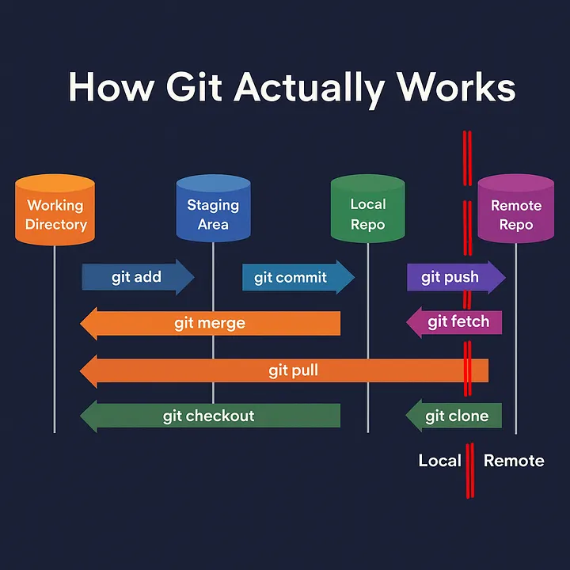
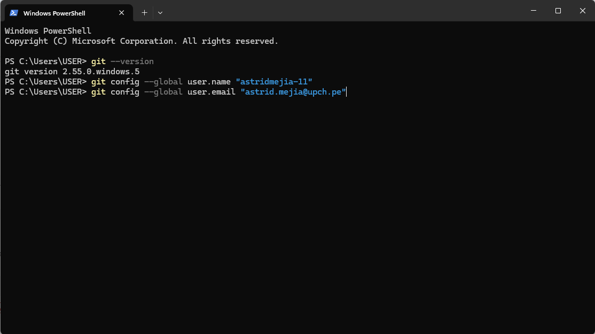
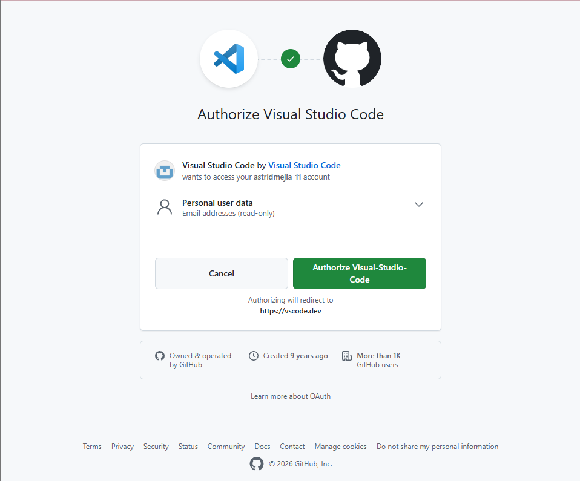
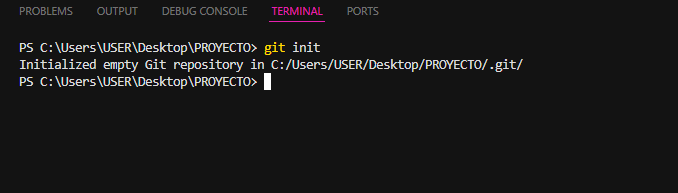
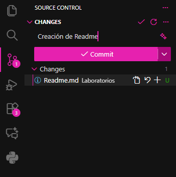
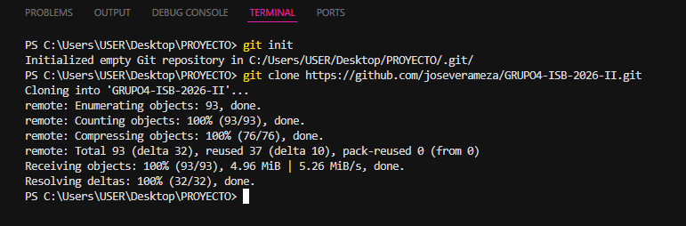
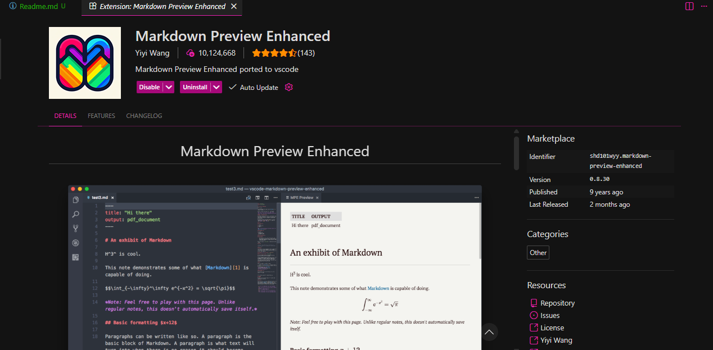
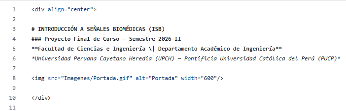
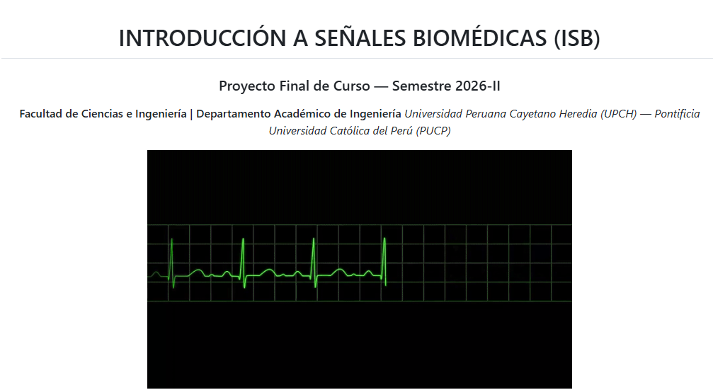

# 1. Introducción

En el desarrollo de proyectos que requieran programación, organización de archivos y trabajo colectivo, es indispensable contar con un sistema de control de versiones que permita registrar cualquier cambio realizado, retomar el trabajo desde un punto, organizar documentos y mantener un historial ordenado del proyecto. En la sesión de laboratorio se abordan los fundamentos de Git como herramienta de control de versiones locales y Github como una plataforma de alojamiento remoto, además se integrarán dentro del editor Visual Studio Code (VS Code) actuando como el entorno de creación y edición de archivos posteriormente visualizados en Github.

El docente explicó la diferencia entre las herramientas en conjunto Git y Github asociándolas con el entorno de Google Drive especializado para programadores, permitiendo de esta forma trabajar en conjunto sin sobreescribir el trabajo de los demás y manteniendo un historial de los cambios realizados. A partir de esta sesión, el curso establece el flujo de trabajo que se utilizará durante todo el ciclo para documentar laboratorios, informes y el proyecto final.

# 2. Objetivos

- Comprender la diferencia conceptual entre Git y GitHub, y la razón por la que se utilizan de forma conjunta en proyectos colaborativos.
- Instalar y configurar Git en el entorno de trabajo local, asociándolo con el nombre de usuario y el correo de GitHub.
- Instalar Visual Studio Code y vincularlo con una cuenta de GitHub.
- Crear una carpeta de trabajo, asociarla al entorno de VS Code y comprender la estructura mínima necesaria para poder subir archivos a un repositorio.
- Inicializar un repositorio local (git init) y registrar el primer commit.
- Aplicar el flujo de trabajo de Source Control en VS Code: staging, mensaje de commit y publicación (push) hacia GitHub.
- Clonar un repositorio remoto existente para iniciar el trabajo colaborativo en equipo.
- Incorporar imágenes y GIFs como evidencia dentro de un repositorio y de documentos Markdown.

# 3. Marco teórico

## 3.1. Git vs. GitHub


*Fig 1. Diferencias generales entre Git y GitHub*

En la Tabla 1 se explica la diferencia entre Git y GitHub para la compresión del laboratorio.

| | Git | GitHub |
|---|---|---|
| ¿Qué es? | Sistema de control de versiones | Plataforma en la nube para alojar repositorios Git |
| ¿Dónde funciona? | Localmente, en la computadora del usuario | En línea; permite colaboración remota |
| Enfoque | Registrar el historial de cambios de los archivos | Alojar el repositorio y facilitar el trabajo en equipo |

*Tabla 1: Diferencias entre Git y GitHub*

En Git se controlan las versiones en el equipo local registrando el historial del proyecto, ahí cada usuario puede realizar cambios que se subirán al GitHub. En esta plataforma, el historial se sube a la nube, de esta manera, las personas del equipo colaboran en el mismo repositorio, similar como cuando un equipo comparte documentos en Google Drive.

## 3.2. Integración con Visual Studio Code

La creación y edición de documentos para el repositorio de Github se pueden hacer a través del terminal del Git, sin embargo, se recomienda el uso de VSCode debido a su simplicidad. Desde su editor es posible ejecutar comandos de Git en la terminal integrada, visualizar la actualización de los archivos mediante la pestaña Source Control y publicar (push) al repositorio vinculado a la cuenta GitHub sin utilizar comandos manuales para cada operación.

## 3.3. Markdown y extensiones de documentación

Markdown (.md) es un lenguaje conocido en la redacción de documentos de forma simple ya que utiliza símbolos para diferenciar la estructura del texto como `#` para títulos, `-` para listas, `**` para texto en negrita, entre otros. Para facilitar la edición de documentos, se agrega en VS Code, la extensión Markdown Preview Enhanced. Nos permite visualizar el documento mientras se edita en tiempo real en su formato de código y visualización en GitHub. Asimismo, facilita la inserción de imágenes y GIFS que ayudan como evidencia visual a la compresión de los informes de laboratorio.

## 3.4 Comandos



*Fig 2. Flujo de comandos de Git entre las áreas de trabajo*

Durante la sesión se trabajaron los comandos básicos que permiten mover un archivo a través de las cuatro áreas de Git (directorio de trabajo, área de preparación, repositorio local y repositorio remoto):

- `git init`: inicializa un nuevo repositorio local dentro de la carpeta de trabajo.
- `git add`: mueve los archivos modificados desde el directorio de trabajo hacia el área de preparación (staging), dejándolos listos para ser confirmados.
- `git commit`: guarda de forma permanente, en el historial del repositorio local, los cambios que se encuentran en el área de preparación, junto con un mensaje descriptivo.
- `git status`: muestra el estado actual del repositorio, indicando qué archivos fueron modificados, cuáles están en staging y cuáles aún no tienen seguimiento.
- `git push`: envía los commits guardados en el repositorio local hacia el repositorio remoto en GitHub.
- `git pull`: descarga y combina en el repositorio local los cambios más recientes que existen en el repositorio remoto.
- `git clone`: crea una copia local completa de un repositorio remoto ya existente, permitiendo comenzar a trabajar sobre él.

En conjunto, estos comandos permiten que un cambio pase del directorio de trabajo al área de preparación mediante `git add`, de ahí al repositorio local mediante `git commit`, y finalmente al repositorio remoto mediante `git push`, cerrando el flujo de trabajo colaborativo representado en la Figura 2.

# 4. Procedimiento

A continuación se detallan los pasos realizados durante la sesión de laboratorio 01.

## 4.1. Instalación y verificación de Git

Se instaló Git según el sistema operativo de cada estudiante. La instalación se verificó ejecutando en la terminal el siguiente comando:

```bash
git --version
```

## 4.2. Configuración de la identidad del usuario

Para que cada commit quede asociado a su autor, se configuró el nombre de usuario y el correo electrónico vinculados a la cuenta de GitHub:

```bash
git config --global user.name "Tu Nombre"
git config --global user.email "tucorreo@upch.pe"
```



*Fig 3. Verificación de la versión de Git y configuración del usuario y correo*

## 4.3. Instalación de VS Code y vinculación con GitHub

Se descargó e instaló Visual Studio Code y, desde la sección Accounts (parte inferior izquierda del editor), se inició sesión y se vinculó la cuenta de GitHub del estudiante, de manera que VS Code quedará autorizado para publicar y sincronizar repositorios sin solicitar credenciales en cada operación.



*Fig 4. Autorización de Visual Studio Code para acceder a la cuenta de GitHub*

## 4.4. Creación de la carpeta de trabajo y apertura en VS Code

Se creó una carpeta en el equipo local y se abrió en VS Code mediante Open Folder, de modo que dicha carpeta quedará asociada al entorno de trabajo del editor. A partir de este punto, todo archivo creado, editado o eliminado dentro de la carpeta es reconocido automáticamente por VS Code.

## 4.5. Inicialización del repositorio local

Dentro de la carpeta de trabajo, se inicializó el repositorio mediante el siguiente comando:

```bash
git init
```

También es posible realizar este paso desde la interfaz de VS Code, en la pestaña Source Control, seleccionando el botón Initialize Repository.



*Fig 5. Inicialización del repositorio local desde la terminal de VS Code*

## 4.6. Creación de carpetas y archivos dentro del repositorio

El profesor señaló un punto importante: Git no reconoce ni sube carpetas vacías. Para que una carpeta quede registrada en el repositorio, debe contener al menos un archivo en su interior (por ejemplo, un README.md o cualquier documento de trabajo).

## 4.7. Flujo de trabajo con Source Control (staging y commit)

Al modificar o crear archivos dentro de la carpeta, estos aparecen listados como cambios pendientes en la pestaña Source Control. El flujo utilizado fue:

- Revisar los archivos modificados listados en Source Control.
- Escribir una pequeña descripción del cambio realizado en el campo de mensaje.
- Presionar el botón Commit para confirmar los cambios en el historial local.



*Fig 6. Panel de Source Control con el archivo preparado y el mensaje de commit*

## 4.8. Publicación del repositorio a GitHub

Para subir el repositorio por primera vez, se utilizó el botón Publish Branch, seleccionando si el repositorio sería Public o Private. VS Code configura automáticamente el remoto (origin) y sube (push) la rama main. Para los commits siguientes, basta con presionar Commit y luego Sync Changes.

## 4.9. Clonación de un repositorio para trabajo en equipo

Finalmente, se mostró cómo clonar un repositorio ya existente en GitHub para comenzar a trabajar de forma colaborativa sobre el mismo proyecto:

```bash
git clone https://github.com/usuario/repositorio.git
```



*Fig 7. Clonación de un repositorio del equipo mediante git clone*

## 4.10. Extensión Markdown Preview Enhanced

Se instaló la extensión Markdown Preview Enhanced desde el panel de extensiones de VS Code, la cual permite visualizar en tiempo real el resultado de los documentos .md mientras se editan, facilitando la revisión del formato antes de subir los cambios al repositorio.



*Fig 8. Extensión Markdown Preview Enhanced instalada en VS Code*

## 4.11. Subida de imágenes al repositorio

Se explicó el procedimiento para subir imágenes al repositorio: se agregan los archivos de imagen dentro de la carpeta del proyecto (por ejemplo, en una subcarpeta images/) y, al igual que con cualquier otro archivo, se realizan los pasos de stage, commit y push para que queden disponibles en GitHub y puedan referenciarse desde los documentos Markdown.



*Fig 9. Referencia de una imagen insertada en un archivo Markdown*



*Fig 10. Vista previa de la imagen renderizada en el README del repositorio*

## 4.12. Subida de GIFs como evidencia

Como último punto, se enseñó a subir GIFs al repositorio siguiendo el mismo procedimiento que con las imágenes, con el fin de utilizarlos como evidencia visual de los procedimientos realizados dentro de los informes de laboratorio.

# 5. Resultados y evidencias

Los resultados de este laboratorio quedan evidenciados a lo largo del procedimiento descrito, mediante los comandos ejecutados y las capturas documentadas en cada sección; dado que este informe se presenta directamente dentro del repositorio de GitHub del grupo, el propio repositorio publicado constituye en sí mismo la evidencia final del trabajo realizado.

# 6. Buenas prácticas y recomendaciones

- Ejecutar `git status` con frecuencia, antes y después de modificar archivos.
- Verificar que cada carpeta del repositorio contenga al menos un archivo antes de intentar subirla.
- Escribir mensajes de commit claros y descriptivos que resuman el cambio realizado.
- Mantener la rama main siempre estable; realizar cambios experimentales en ramas separadas cuando el equipo lo requiera.
- Sincronizar (pull) antes de empezar a trabajar, para evitar conflictos con los cambios de los demás integrantes del equipo.
- Usar la extensión Markdown Preview Enhanced para revisar el formato del documento antes de subirlo.
- Organizar las imágenes y GIFs en subcarpetas (por ejemplo, images/) para mantener el repositorio ordenado.

# 7. Referencias

Meza, M. (2025). *Getting Started with Git and GitHub: From Zero to Teamwork.* Medium. https://medium.com/@moises.meza/getting-started-with-git-and-github-from-zero-to-teamwork-683c634baac8

Meza, M. (2025). *VS Code and Markdown: A Perfect Combination.* Medium. https://medium.com/@moises.meza/vscode-and-markdown-a-perfect-combination-e236e07065e9

Documentación oficial de Git: https://git-scm.com/doc

Documentación oficial de GitHub: https://docs.github.com
