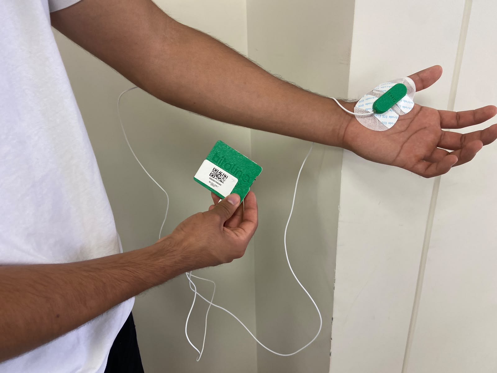
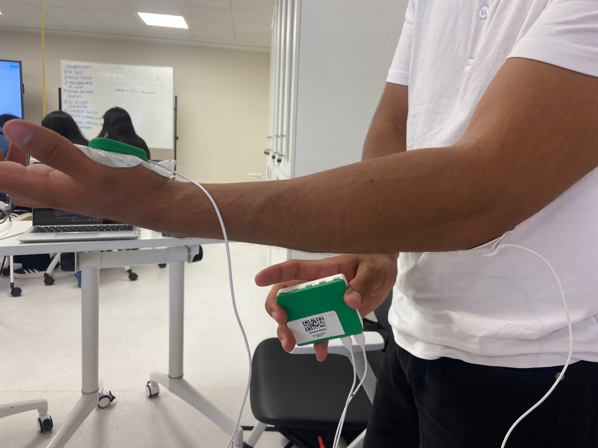
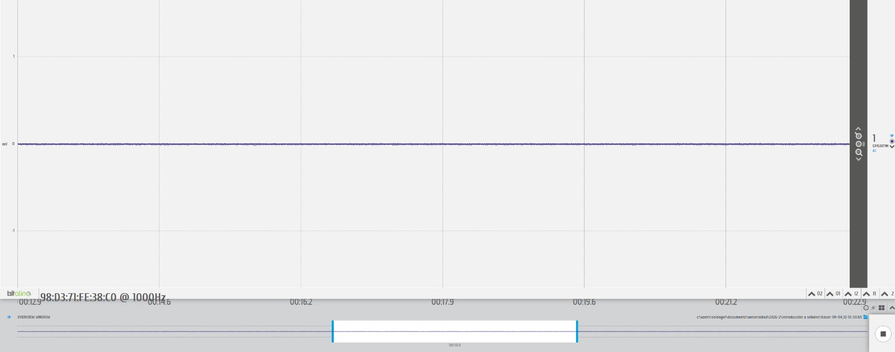
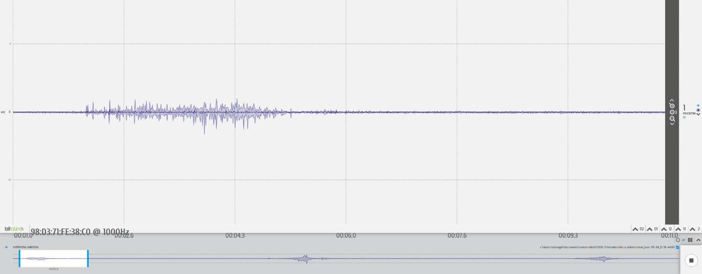
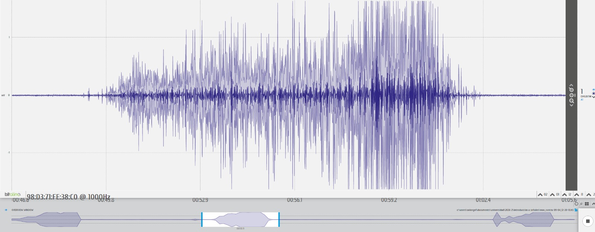

<h1 align="center">Análisis de Señales EMG: Músculo Abductor Pollicis y Antebrazo</h1>

<em>Laboratorio 3 — Introducción a Señales Biomédicas</em>

## Índice
 
- [1. Introducción](#1-introducción)
- [2. Materiales y equipo](#2-materiales-y-equipo)
- [3. Protocolo de adquisición](#3-protocolo-de-adquisición)
- [4. Procedimiento](#4-procedimiento)
  - [4.1 Filtrado](#41-filtrado)
  - [4.2 Envolvente RMS](#42-envolvente-rms)
  - [4.3 Análisis espectral y frecuencia mediana (MDF)](#43-análisis-espectral-y-frecuencia-mediana-mdf)
- [5. Resultados](#5-resultados)
  - [5.1 Músculo abductor pollicis](#51-músculo-abductor-pollicis)
  - [5.2 Músculo del antebrazo](#52-músculo-del-antebrazo)
  - [5.3 Comparación entre estadios y músculos](#53-comparación-entre-estadios-y-músculos)
- [6. Discusión](#6-discusión)
- [7. Conclusiones](#7-conclusiones)
- [8. Referencias](#8-referencias)

# 1. Introducción
La electromiografía de superficie (sEMG) es una técnica no invasiva que permite registrar la actividad eléctrica generada por los músculos mediante sensores colocados sobre la piel, que captan los potenciales de acción de las fibras musculares que se contraen.
En este laboratorio se realizaron mediciones de señales EMG en dos grupos musculares: el músculo abductor pollicis brevis y el músculo flexor radial del carpo, bajo tres estadíos de actividad: en reposo, movimiento leve y movimiento con oposición, dejando 30 segundos de reposo entre cada medición. El objetivo del laboratorio es caracterizar la señal EMG conforme aumenta la intensidad de contracción muscular.

# 2. Materiales y equipo
| Equipo | Cantidad |
| :--- | :--- |
| Kit Bitalino | 1 |
| Cables y electrodos | 3 |
| Laptop | 1 |

# 3. Protocolo de adquisición
 
Previo a la colocación de los electrodos, se limpió la zona de la piel con alcohol isopropílico y se dejó secar para asegurar una mejor conductividad y minimizar el ruido en la señal. 
=======

## Procedimiento

## Medición del abductor pollicis brevis (pulgar)
>>>>>>> origin/main

   

   

Los electrodos se colocaron siguiendo la guía de colocación de electrodos de BITalino, asegurando que los dos electrodos se colocaran en dirección a las fibras musuclares a medir, además del tercer electrodo colocado en el codo tomandolo como tierra para ambas mediciones musculares.

   

   

Las señales se adquirieron con un sensor BITalino (r)evolution (`EMGBITREV`), a una frecuencia de muestreo de 1000 Hz, mediante el software OpenSignals (r)evolution. Para cada músculo se registraron tres archivos:
 
- **Reposo**: 30 segundos sin actividad muscular voluntaria.
- **Movimiento controlado**: 3 repeticiones del movimiento (pulgar–meñique para el abductor pollicis), con 30 segundos de reposo entre cada repetición.
- **Movimiento de contrafuerza**: 3 repeticiones de contracción contra resistencia, con 30 segundos de reposo entre cada repetición.
La lectura de los archivos `.txt` (formato OpenSignals) y la conversión a milivoltios se realizó con la librería [`opensignalsreader`](https://github.com/PGomes92/opensignalsreader), que aplica automáticamente las funciones de transferencia oficiales de BITalino.

# 4. Procedimiento
## 4.1 Filtrado
 
A cada señal se le removió el offset DC (resta de la media) y se aplicó un filtro pasa-altos Butterworth de orden 4 con frecuencia de corte en 20 Hz, seguido de un filtro notch en 60 Hz (frecuencia de la red eléctrica en el Perú) para eliminar la interferencia de línea. Ambos filtros se aplicaron con fase cero (`filtfilt`) para no introducir desfases en la señal.
 
## 4.2 Envolvente RMS
 
La señal EMG cruda oscila muy rápido (decenas a cientos de Hz) alrededor de cero, por lo que a simple vista es difícil distinguir cuándo el músculo está realmente contraído y cuándo está en reposo, sobre todo en los registros largos de movimiento (97–139 s) que incluyen las 3 repeticiones separadas por pausas. Para resolver esto se calculó una **envolvente RMS**: en vez de mirar cada muestra individual, se obtiene la raíz media cuadrática (RMS) de la señal dentro de una ventana móvil de 200 ms, con un paso de 50 ms entre ventanas sucesivas. El resultado es una curva suave que sigue la intensidad de la contracción a lo largo del tiempo, sin el ruido de alta frecuencia de la señal cruda.
 
En las figuras de la sección 4, la envolvente se muestra como la **línea negra** superpuesta sobre la señal filtrada (en color): sube cuando el músculo se contrae y cae cerca de cero cuando vuelve al reposo. Gracias a esto, en los estadios de movimiento controlado y contrafuerza se distinguen visualmente los 3 "montículos" que corresponden a las 3 repeticiones del protocolo, separados por los tramos de reposo.
 
## 4.3 Análisis espectral y frecuencia mediana (MDF)
 
Se calculó el espectro de frecuencia mediante la Transformada Rápida de Fourier (FFT) con ventana de Hanning, expresado en decibelios. A partir de la potencia espectral acumulada se estimó la **frecuencia mediana (MDF)**, definida como la frecuencia por debajo de la cual se concentra el 50% de la potencia total de la señal. La MDF es un indicador comúnmente usado para caracterizar cambios en el patrón de reclutamiento de unidades motoras y fatiga muscular.

# 5. Resultados

## 5.1 Músculo abductor pollicis

   

Figura X. Extraído de “BITalino (r)evolution Lab Guide” [Online]. Available:https://support.pluxbiosignals.com/wp-content/uploads/2022/04/HomeGuide1_EMG.pdf 

   

De acuerdo con la Figura X, los electrodos se colocan para realizar la medición de la actividad del músculo abductor pollicis. Los dos electrodos de medición se ubican longitudinalmente sobre la base del dedo pulgar, con 2 cm de espaciado,  mientras que el electrodo de referencia, utilizado como tierra, se coloca a nivel del codo.

| **En reposo** | **Movimiento leve** | **Movimiento con oposición** |
|:------------------:|:----------------------:|:----------------------:|
| [▶️ Ver video](https://github.com/joseverameza/GRUPO4-ISB-2026-II/blob/main/Laboratorios/Lab_03/Imagenes/pulgar_reposo.mp4) | [▶️ Ver video](https://github.com/joseverameza/GRUPO4-ISB-2026-II/blob/main/Laboratorios/Lab_03/Imagenes/pulgar_m_leve.mp4) | [▶️ Ver video](https://github.com/joseverameza/GRUPO4-ISB-2026-II/blob/main/Laboratorios/Lab_03/Imagenes/pulgar_cont.mp4) |

### Señal en OpenSignals
En reposo

   

Movimiento leve

   

Movimiento con opsición

   

### Ploteo en Phyton
En reposo

   

Movimiento leve

   

Movimiento con opsición

   

###Análisis
En reposo, la señal se mantiene prácticamente plana, oscilando apenas entre -0.015 y 0.013 mV, con la envolvente pegada casi en línea recta alrededor de 0.003-0.004 mV: no hay ninguna ráfaga ni pico que sugiera contracción muscular, tal como se esperaba. En el espectro de esta parte no aparece nada parecido a un patrón EMG: el piso de ruido es bastante parejo entre -10 y -20 dB, pero sobresalen dos picos angostos y bien marcados cerca de 200 Hz y 400 Hz que casi tocan los 0 dB. Como el músculo no estaba activo, estos picos no pueden ser actividad muscular real, sino que parecen ruido electrónico o digital del propio sistema de adquisición (se nota además el "hueco" justo en 60 Hz, que confirma que el notch de red sí está funcionando). Como esos picos dominan la energía total, la MDF calculada para este tramo sale bastante alta (222.8 Hz), pero ese valor no tiene un significado fisiológico real, simplemente refleja dónde está el ruido.

En movimiento controlado aparecen tres ráfagas de activación bien definidas, ubicadas aproximadamente en los segundos 4, 43 y 86, cada una separada por los tramos de reposo del protocolo. Dos de las ráfagas se mueven en un rango de amplitud de hasta ±0.3-0.4 mV, mientras que la del segundo repetición (~43 s) tiene un pico aislado y muy angosto que llega hasta casi -1.0 mV, probablemente un artefacto de contacto o de movimiento del electrodo más que una contracción sostenida de esa magnitud, ya que la envolvente en ese mismo punto solo llega a 0.14 mV. Fuera de las tres ráfagas la señal vuelve a estar prácticamente en cero, confirmando que cada una corresponde a un evento puntual de contracción. El espectro ya no tiene los picos angostos del reposo: la energía se reparte de forma más amplia entre 20 y 300 Hz, sin una caída tan abrupta como en el reposo, y la MDF baja a 179.3 Hz, coherente con que ahora sí hay actividad muscular real mezclada con el ruido de fondo.

En movimiento de contrafuerza el cambio es mucho más notorio: las tres ráfagas (~0-16 s, ~49-62 s y ~117-132 s) son visiblemente más anchas y sostenidas que en movimiento controlado, y la amplitud sube muchísimo, con la envolvente alcanzando picos de hasta 0.83 mV y la señal cruda oscilando hasta ±1.8 mV, más de cuatro veces lo visto en movimiento controlado. Esto es justo lo esperado cuando el músculo tiene que vencer resistencia: se reclutan más unidades motoras y la contracción se mantiene más tiempo. El espectro también cambia de forma: ahora sí se nota una concentración clara de energía por debajo de ~150 Hz, con niveles bastante más altos (entre 0 y -20 dB) que en las otras dos condiciones, y la MDF cae a 91.0 Hz, reflejando ese corrimiento hacia frecuencias bajas típico de contracciones más fuertes y sostenidas.

En resumen, en el abductor pollicis se ve la misma tendencia esperada: a mayor esfuerzo, mayor amplitud y mayor duración de cada ráfaga de activación, y el espectro se va concentrando cada vez más en frecuencias bajas (MDF cayendo de ~223 Hz a ~91 Hz). La diferencia particular de nuestros datos es que en reposo el "ruido" no es un piso parejo sino que tiene picos marcados en 200 y 400 Hz, así que conviene tenerlo en cuenta al interpretar la MDF de ese tramo, ya que no representa actividad muscular.

## 5.2 Músculo del antebrazo

   

Figura X. Extraído de “BITalino (r)evolution Lab Guide” [Online]. Available:https://support.pluxbiosignals.com/wp-content/uploads/2022/04/HomeGuide1_EMG.pdf 

   

De acuerdo con la Figura X, los electrodos se colocan para realizar la medición de la actividad del músculo flexor radial del carpo. Los dos electrodos de medición se ubican longitudinalmente sobre la fibra muscular, con 2 cm de espaciado,  mientras que el electrodo de referencia, utilizado como tierra, se coloca a nivel del codo.

| **En reposo** | **Movimiento leve** | **Movimiento con oposición** |
|:------------------:|:----------------------:|:----------------------:|
| [▶️ Ver video](https://github.com/joseverameza/GRUPO4-ISB-2026-II/blob/main/Laboratorios/Lab_03/Imagenes/Carpo_reposo.mp4) | [▶️ Ver video](https://github.com/joseverameza/GRUPO4-ISB-2026-II/blob/main/Laboratorios/Lab_03/Imagenes/leve_carpo_f.mp4) | [▶️ Ver video](https://github.com/joseverameza/GRUPO4-ISB-2026-II/blob/main/Laboratorios/Lab_03/Imagenes/contra_carpo_f.mp4) |

### Señal en OpenSignals
En reposo

   

Movimiento leve

   

Movimiento con opsición

   

### Ploteo en Phyton
En reposo

   

Movimiento leve

   

Movimiento con opsición

   

### Análisis

Como se puede ver en las tres gráficas, hay una relación bastante clara entre el nivel de esfuerzo y la señal EMG registrada.

En reposo, la señal se mantiene prácticamente plana, oscilando apenas entre -0.02 y 0.01 mV, sin ninguna ráfaga o pico que indique contracción muscular. En el espectro de frecuencia de esta parte se nota un pico bien marcado cerca de los 60 Hz y otro alrededor de los 400 Hz, que son compatibles con interferencia eléctrica o ruido de la línea eléctrica y no a actividad muscular real, lo cual tiene sentido porque en teoría el músculo no debería estar activo.

En movimiento leve la cosa cambia bastante: aparecen tres ráfagas claras de activación (alrededor de los segundos 5, 47 y 95), con una amplitud que llega hasta 0.4 mV en el pico más alto. Fuera de esas ráfagas la señal vuelve a estar cerca de cero, lo que confirma que cada una corresponde a una contracción puntual del músculo. En el espectro se ve que la energía se concentra más que nada entre 0 y 150 Hz, con una caída conforme sube la frecuencia, un patrón bastante típico de EMG.

Con oposición, la amplitud sube muchísimo más, llegando hasta ±1.5 mV, casi cuatro veces lo que se vio en movimiento leve. Las tres ráfagas (cerca de los segundos 10, 60 y 115) también se ven más anchas y sostenidas, como si la contracción durara más tiempo y con más fuerza, que es justo lo que se espera cuando el músculo tiene que vencer resistencia. El espectro también sube de nivel en general, con magnitudes entre -60 y -80 dB en las frecuencias más bajas, comparado con los -100 dB que se veían en movimiento leve, aunque la forma general del espectro (concentrado en frecuencias bajas y medias) se mantiene parecida.

En resumen, se ve claramente cómo a mayor esfuerzo o resistencia aumenta tanto la amplitud como la duración de la actividad muscular, mientras que en reposo lo único presente es ruido de fondo sin ningún patrón de contracción.

## Cuestionario
**¿Cuáles son las frecuencias significativas para las adquisiciones de EMG? ¿Son las mismas en todas las áreas del cuerpo, como el área facial?**
> La señal EMG útil se concentra entre 20 y 450 Hz aproximadamente, con la mayor parte de la energía entre 50 y 150 Hz, tal como se aprecia en los espectros obtenidos en las tres condiciones (reposo, leve y con oposición). Sin embargo, no son exactamente las mismas en todo el cuerpo: en zonas como el rostro los músculos son más pequeños y delgados, lo que genera señales de menor amplitud y más sensibles al ruido, por lo que el contenido frecuencial puede variar un poco respecto a músculos grandes como el flexor radial del carpo.

**¿Qué tipo de filtro es esencial al trabajar con señales de EMG? ¿Por qué necesitamos aplicar dicho filtro?**
> Es fundamental usar un filtro pasa banda (entre 20 y 450 Hz aprox.) junto con un filtro notch en 50/60 Hz. El pasa banda elimina tanto los artefactos de movimiento en bajas frecuencias como el ruido de alta frecuencia que no corresponde a actividad muscular, mientras que el notch quita la interferencia de la red eléctrica, que se nota como picos puntuales en las FFT obtenidas (por ejemplo cerca de 60 Hz y sus armónicos). Sin este filtrado, la señal se contamina y es difícil distinguir la actividad muscular real.

**¿Cómo varía la amplitud en cada contracción muscular? ¿Hay diferencia según la ubicación en el cuerpo?**
> La amplitud aumenta conforme la contracción es más intensa: en reposo apenas se ve ruido de fondo (~0.02 mV), en movimiento leve sube a un rango de 0.2-0.4 mV, y en movimiento con oposición llega hasta 1.5 mV aproximadamente. Esto pasa porque al necesitar más fuerza, el cuerpo recluta más unidades motoras y estas disparan con mayor frecuencia. También influye la ubicación: músculos grandes y superficiales como el flexor radial del carpo dan señales más fuertes que músculos pequeños o más profundos, ya que hay más fibras activas cerca del electrodo y menos tejido que atenúe la señal.

**¿Equivale la amplitud de la EMG a la cantidad de fuerza que has generado con tu músculo?**
> No exactamente. Hay una relación entre ambas (a mayor fuerza, mayor amplitud), pero no es una equivalencia directa ni lineal, ya que factores como la posición de los electrodos, el grosor de la piel y tejido adiposo, la fatiga muscular y el crosstalk de músculos cercanos afectan la lectura. Para usar la EMG como estimador real de fuerza se necesitaría normalizar la señal respecto a una contracción máxima voluntaria, así que el valor en mV que se obtiene es más una referencia relativa que una medida calibrada de fuerza.
