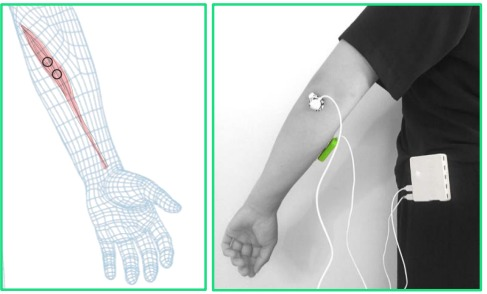
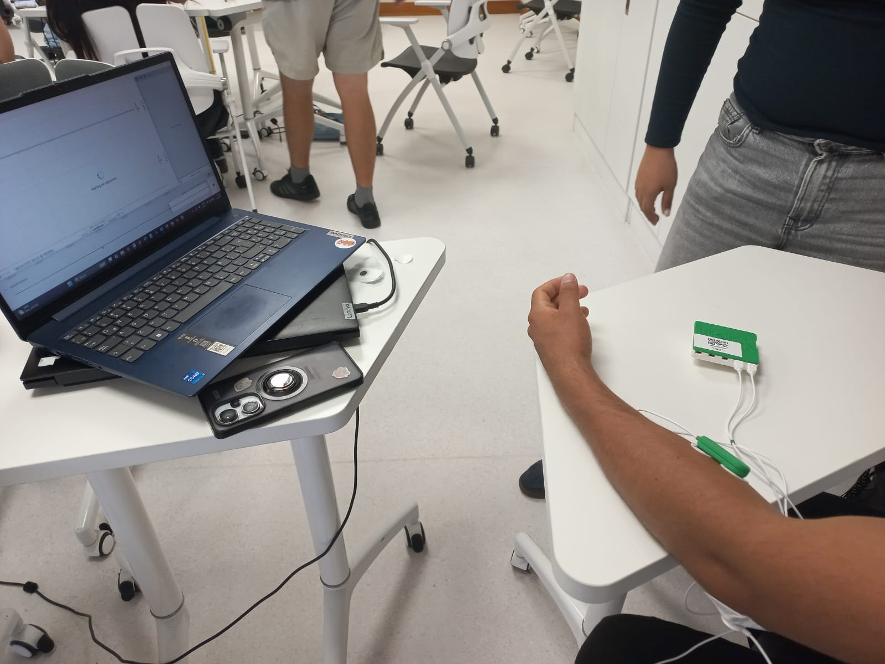
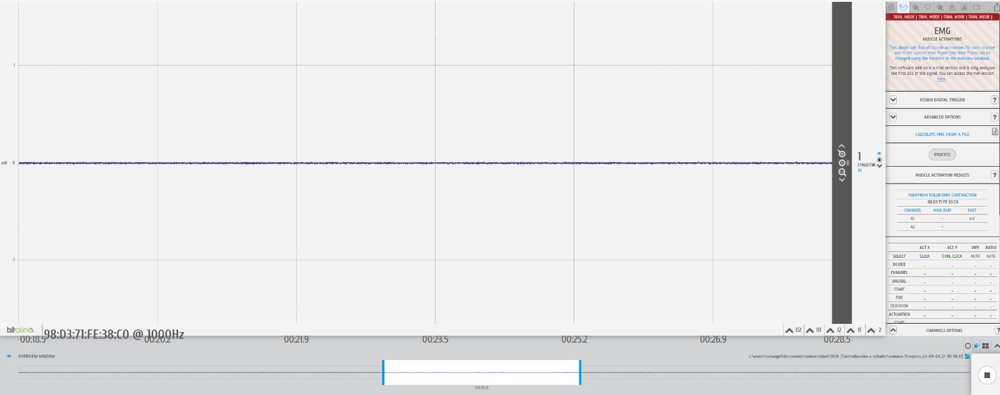
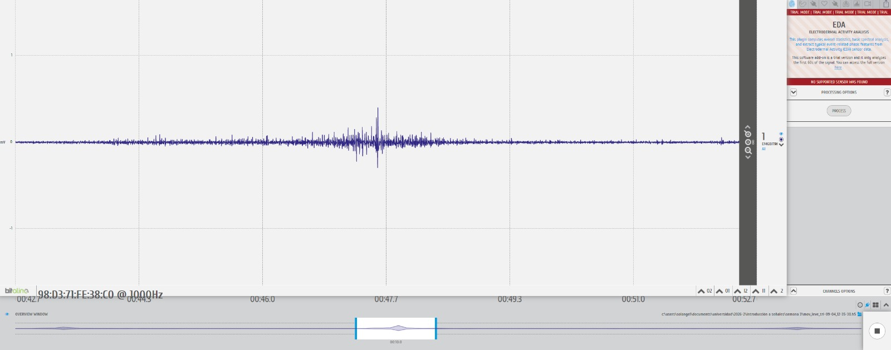
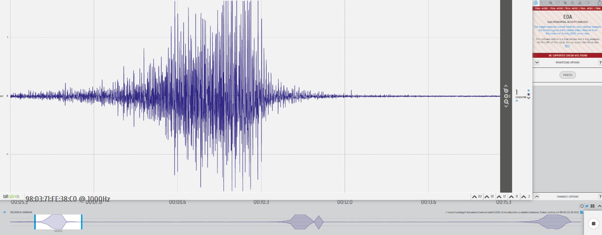

<h1 align="center">LABORATORIO 3: BiTalino</h1>

## Introducción

## Materiales y equipo
| Equipo | Cantidad |
| :--- | :--- |
| Kit Bitalino | 1 |
| Cables y electrodos | 3 |
| Laptop | 1 |

## Procedimiento

## Medición del pulgar

## Medición del músculo flexor radial del carpo

   

Figura X. Extraído de “BITalino (r)evolution Lab Guide” [Online]. Available:https://support.pluxbiosignals.com/wp-content/uploads/2022/04/HomeGuide1_EMG.pdf 

   

De acuerdo con la Figura X, los electrodos se colocan para realizar la medición de la actividad del músculo flexor radial del carpo. Los dos electrodos de medición se ubican longitudinalmente sobre la fibra muscular, con 2 cm de espaciado,  mientras que el electrodo de referencia, utilizado como tierra, se coloca a nivel del codo.

| **En reposo** | **Movimiento leve** | **Movimiento con oposición** |
|:------------------:|:----------------------:|:----------------------:|
| [▶️ Ver video](https://github.com/joseverameza/GRUPO4-ISB-2026-II/blob/main/Laboratorios/Lab_03/Imagenes/Carpo_reposo.mp4) | [▶️ Ver video](https://github.com/joseverameza/GRUPO4-ISB-2026-II/blob/main/Laboratorios/Lab_03/Imagenes/leve_carpo_f.mp4) | [▶️ Ver video](https://github.com/joseverameza/GRUPO4-ISB-2026-II/blob/main/Laboratorios/Lab_03/Imagenes/contra_carpo_f.mp4) |

### Señal en OpenSignals
En reposo

   

Movimiento leve

   

Movimiento con opsición

   

### Ploteo en Phyton
En reposo

   

Movimiento leve

   

Movimiento con opsición

   

### Análisis

## Cuestionario
**¿Cuáles son las frecuencias significativas para las adquisiciones de EMG? ¿Son las mismas en todas las áreas del cuerpo, como el área facial?**
> La señal EMG útil se concentra entre 20 y 450 Hz aproximadamente, con la mayor parte de la energía entre 50 y 150 Hz, tal como se aprecia en los espectros obtenidos en las tres condiciones (reposo, leve y con oposición). Sin embargo, no son exactamente las mismas en todo el cuerpo: en zonas como el rostro los músculos son más pequeños y delgados, lo que genera señales de menor amplitud y más sensibles al ruido, por lo que el contenido frecuencial puede variar un poco respecto a músculos grandes como el flexor radial del carpo.

**¿Qué tipo de filtro es esencial al trabajar con señales de EMG? ¿Por qué necesitamos aplicar dicho filtro?**
> Es fundamental usar un filtro pasa banda (entre 20 y 450 Hz aprox.) junto con un filtro notch en 50/60 Hz. El pasa banda elimina tanto los artefactos de movimiento en bajas frecuencias como el ruido de alta frecuencia que no corresponde a actividad muscular, mientras que el notch quita la interferencia de la red eléctrica, que se nota como picos puntuales en las FFT obtenidas (por ejemplo cerca de 60 Hz y sus armónicos). Sin este filtrado, la señal se contamina y es difícil distinguir la actividad muscular real.

**¿Cómo varía la amplitud en cada contracción muscular? ¿Hay diferencia según la ubicación en el cuerpo?**
> La amplitud aumenta conforme la contracción es más intensa: en reposo apenas se ve ruido de fondo (~0.02 mV), en movimiento leve sube a un rango de 0.2-0.4 mV, y en movimiento con oposición llega hasta 1.5 mV aproximadamente. Esto pasa porque al necesitar más fuerza, el cuerpo recluta más unidades motoras y estas disparan con mayor frecuencia. También influye la ubicación: músculos grandes y superficiales como el flexor radial del carpo dan señales más fuertes que músculos pequeños o más profundos, ya que hay más fibras activas cerca del electrodo y menos tejido que atenúe la señal.

**¿Equivale la amplitud de la EMG a la cantidad de fuerza que has generado con tu músculo?**
> No exactamente. Hay una relación entre ambas (a mayor fuerza, mayor amplitud), pero no es una equivalencia directa ni lineal, ya que factores como la posición de los electrodos, el grosor de la piel y tejido adiposo, la fatiga muscular y el crosstalk de músculos cercanos afectan la lectura. Para usar la EMG como estimador real de fuerza se necesitaría normalizar la señal respecto a una contracción máxima voluntaria, así que el valor en mV que se obtiene es más una referencia relativa que una medida calibrada de fuerza.
