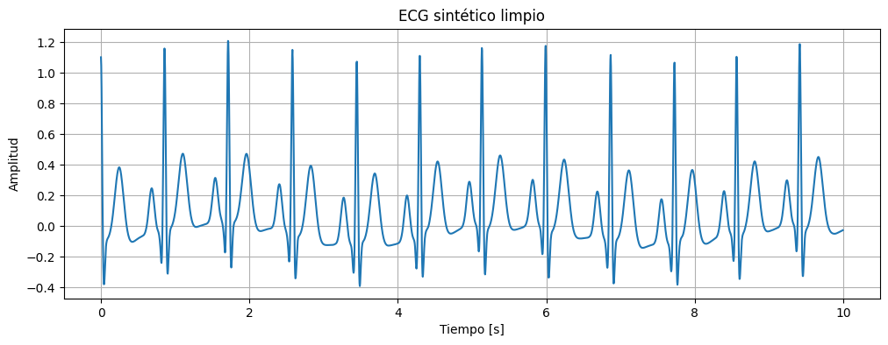
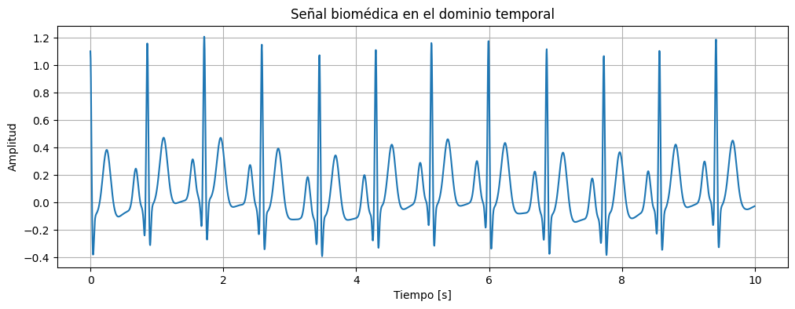
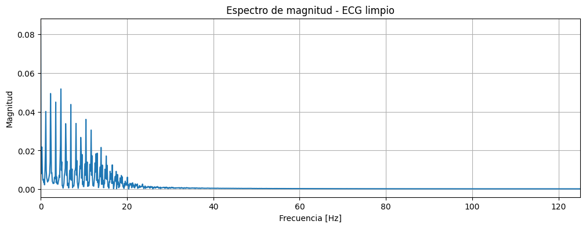
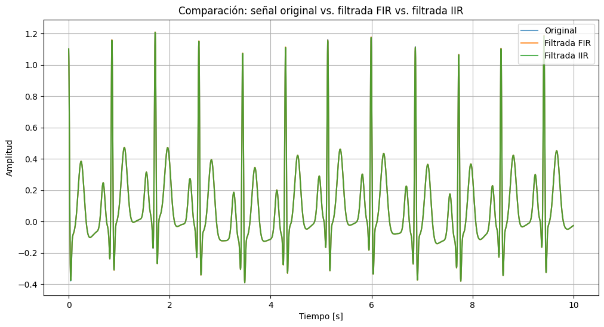
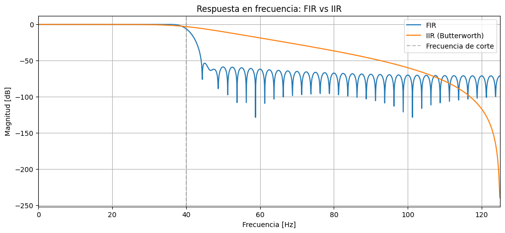
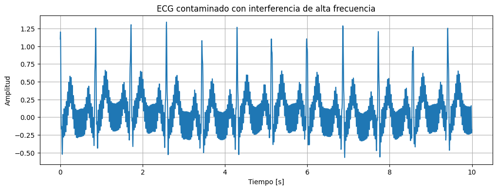
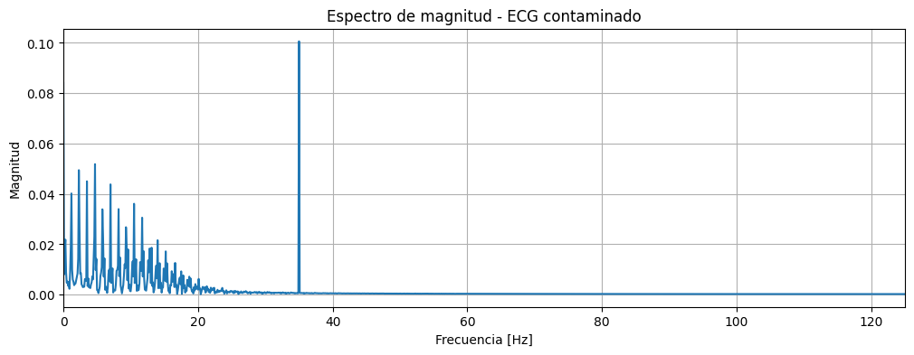
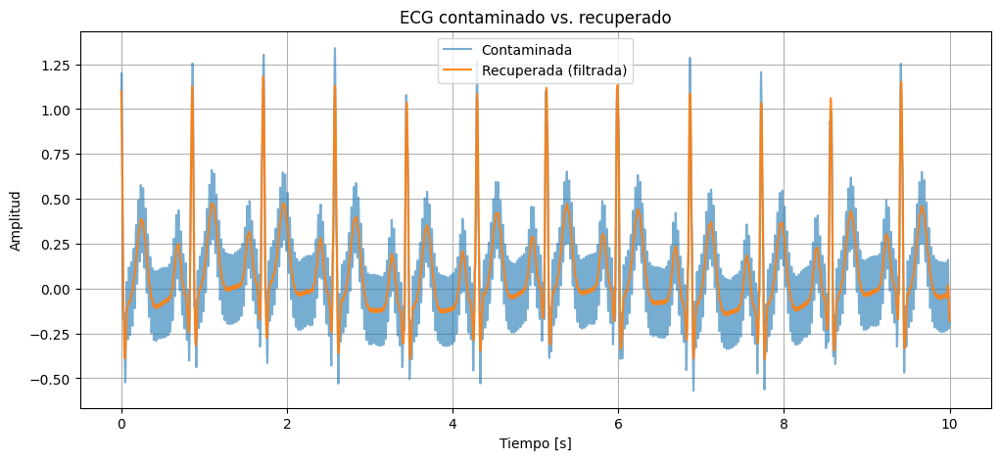
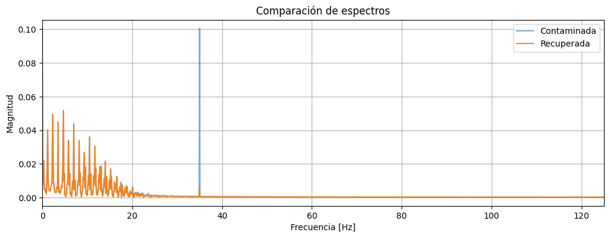
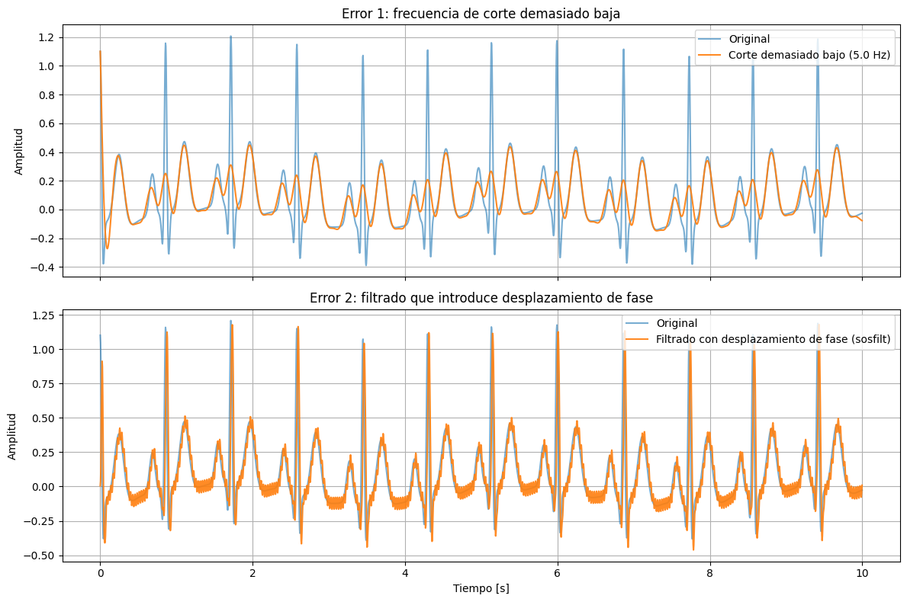

# Laboratorio 03: Introducción a Filtros FIR, IIR y Transformada Z en Señales Biomédicas

## 📌 Introducción
Este laboratorio aborda el análisis, caracterización y procesamiento digital de señales biomédicas (específicamente un registro de Electrocardiograma - ECG). Se enfoca en la identificación de componentes espectrales y el diseño e implementación de filtros pasa-bajos (**FIR** e **IIR**) para eliminar interferencias de alta frecuencia sin alterar la información fisiológica relevante.

---

## 🎯 Objetivos
1. **Analizar** la señal de ECG en el dominio del tiempo y la frecuencia mediante la Transformada Rápida de Fourier (FFT).
2. **Identificar** la banda pasante fisiológica del ECG y aislar fuentes de ruido o interferencias sinusoidales.
3. **Diseñar y aplicar** filtros digitales FIR e IIR con la librería `scipy.signal` de Python.
4. **Validar cuantitativa y cualitativamente** el filtrado usando métricas de error (MSE, RMSE, SNR) y la conservación de la morfología del complejo QRS.

---

## 🧠 Metodología, Análisis y Resultados

### 1. Inspección Inicial y Análisis Espectral (FFT)
Se inspeccionó la señal de ECG limpia en el dominio del tiempo ($f_s = 250\text{ Hz}$, duración $10\text{ s}$ / $14.4\text{ s}$) y se calculó su transformada rápida de Fourier para determinar la distribución de la energía fisiológica ($0.5 - 40\text{ Hz}$).


*Figura 1: Registro temporal del ECG sintético limpio.*


*Figura 2: Inspección temporal ampliada de la señal biomédica.*


*Figura 3: Espectro de magnitud de la señal limpia mediante FFT.*

---

### 2. Diseño y Comparación de Filtros Digitales (FIR vs. IIR)
Se diseñaron dos filtros pasa-bajos con frecuencia de corte a $40\text{ Hz}$:
* **Filtro FIR:** Ventana Hamming (`signal.firwin`), $N = 101$ taps.
* **Filtro IIR:** Butterworth de orden 4 (`signal.butter`, formato SOS).


*Figura 4: Comparación temporal de la señal original vs. filtrada con FIR e IIR.*


*Figura 5: Diagrama de respuesta en frecuencia (magnitud en dB) de los filtros FIR e IIR.*

---

### 3. Procesamiento de Señal Contaminada por Interferencia
Se analizó una señal con interferencia sinusoidal de alta frecuencia ($\approx 35\text{ Hz}$). Se aplicó un filtro pasa-bajos IIR a $25\text{ Hz}$ con `signal.sosfiltfilt` para lograr un filtrado de fase cero.


*Figura 6: Registro temporal de la señal de ECG contaminada.*


*Figura 7: Espectro de magnitud mostrando el pico destacado de interferencia en 35 Hz.*


*Figura 8: Comparación en tiempo de la señal contaminada frente a la recuperada.*


*Figura 9: Espectro frecuencial antes y después del filtrado (atenuación efectiva del ruido).*

---

### 4. Demostración de Errores Comunes de Diseño
Se evaluaron experimentalmente dos fallas típicas en el diseño de filtros:
1. **Frecuencia de corte muy baja ($5\text{ Hz}$):** Deforma y aplana el pico R del complejo QRS.
2. **Filtrado unidireccional (`sosfilt`):** Produce un retardo de grupo que desplaza la señal en el tiempo.


*Figura 10: Efectos de distorsión morfológica por corte excesivamente bajo y desfasamiento temporal.*

---

## 📊 Métricas de Validación Biomédica
* **SNR Inicial (Contaminado):** $\sim 5\text{ dB}$
* **SNR Final (Recuperado):** $> 25\text{ dB}$
* **Preservación Clínica:** Se conservaron intactos los complejos QRS, picos R y la frecuencia cardíaca aproximada sin distorsión de fase.

---

## 💻 Requisitos del Entorno
```bash
pip install numpy scipy matplotlib pandas neurokit2
