<h1 align="center">Electrocardiograma (ECG): Reposo, Hiperventilación, Hipoventilación y Actividad Aeróbica</h1>

<em>Laboratorio 4 — Introducción a Señales Biomédicas</em>

# Índice
 
- [1. Introducción](#1-introducción)
- [2. Materiales](#2-materiales)
- [3. Procedimiento de toma de muestras](#3-procedimiento-de-toma-de-muestras)
  - [3.1 Actividades realizadas](#31-actividades-realizadas)
  - [3.2 Protocolo de adquisición por derivación](#32-protocolo-de-adquisición-por-derivación)
- [4. Ubicación de electrodos por derivación](#4-ubicación-de-electrodos-por-derivación)
- [5. Señal en OpenSignals](#5-señal-en-opensignals)
  - [5.1 Reposo](#51-reposo)
  - [5.2 Hiperventilación](#52-hiperventilación)
  - [5.3 Hipoventilación](#53-hipoventilación)
  - [5.4 Actividad aeróbica](#54-actividad-aeróbica)
- [6. Video de muestra](#6-video-de-muestra)
- [7. Señal procesada en Python](#7-señal-procesada-en-python)
  - [7.1 Reposo](#71-reposo)
  - [7.2 Hiperventilación](#72-hiperventilación)
  - [7.3 Hipoventilación](#73-hipoventilación)
  - [7.4 Actividad aeróbica](#74-actividad-aeróbica)
- [8. Análisis](#8-análisis)
- [9. Respuestas al cuestionario](#9-respuestas-al-cuestionario)
- [10. Referencias](#10-referencias)
# 1. Introducción
El corazón bombea sangre oxigenada de la aurícula izquierda al ventrículo izquierdo, a la aorta y hacia el resto del cuerpo; el nódulo sinoatrial (SA node) inicia la actividad eléctrica, se propaga al nodo atrioventricular (AV node) conocido como el marcapasos del corazón, de ahí se propaga a las ramas del haz y las fibras de Purkinje. Durante la excitación de una célula, esta se vuelve más positiva que sus vecinas, generando un dipolo; la suma de estos dipolos forma un vector que se puede medir en la superficie de la piel. Cada etapa del ciclo cardíaco representa un componente distinto de la señal representada en un electrocardiograma.
El electrocardiograma es una prueba que permite registrar la actividad eléctrica del corazón producida por cada latido. El músculo cardiaco puede producir señales eléctricas que son detectables en la superficie de la piel usando un sensor ECG. Durante el laboratorio se desarrolla la recolección de la actividad eléctrica del músculo cardiaco mediante el sensor de ECG de BITalino.

 
# 2. Materiales
 
- OpenSignals (r)evolution (software de adquisición)
- 1x BITalino (r)evolution Assembled Core BT
- 1x Sensor de Electrocardiografía (ECG) ensamblado
- 3x Electrodos desechables autoadhesivos gelificados Ag/AgCl

# 3. Procedimiento de toma de muestras
 
## 3.1 Actividades realizadas
 
Para cada una de las siguientes condiciones se registró la señal ECG en las tres derivaciones (DI, DII, DIII), recolocando los electrodos entre cada derivación:
Se realizaron 4 actividades de medición, 30 segundos midiendo durante el reposo, 30 segundos midiendo después de un proceso de hiperventilación, 30 segundos midiendo después de un proceso de hipoventilación y 30 segundos midiendo después de un proceso de actividad aeróbica, realizando las 3 derivaciones en una sola pasada. 
 
| Actividad | DI | DII | DIII |
|---|---|---|---|
| Reposo (30 s) | ☐ | ☐ | ☐ |
| Hiperventilación | ☐ | ☐ | ☐ |
| Hipoventilación | ☐ | ☐ | ☐ |
| Actividad aeróbica | ☐ | ☐ | ☐ |
 
## 3.2 Protocolo de adquisición por derivación
 
1. Colocar los electrodos según la posición correspondiente a la derivación en turno (ver sección 4).
2. **Reposo:** iniciar grabación y mantener 30 s sin hablar ni moverse, en postura cómoda.
3. **Hiperventilación:** iniciar grabación y, después de los 30 s de registro, realizar el ciclo inhalar–retener–exhalar de forma repetida (la maniobra se realiza para llenar los pulmones con la mayor cantidad de oxígeno).
4. **Hipoventilación:** iniciar grabación y retener la respiración el mayor tiempo posible antes del registro.
5. **Actividad aeróbica:** realizar la actividad física indicada durante un periodo de 6-10 minutos hasta llegar a la fatiga muscular, sentarse rápidamente y grabar de inmediato para capturar la frecuencia cardíaca elevada. En el caso del laboratorio se realizaron saltos y trote durante 8 minutos.
6. Entre cada derivación (DI → DII → DIII) descansar ~30 s–1 min para permitir recolocar los electrodos y que el ritmo cardíaco se estabilice antes de la siguiente toma.

 
# 4. Ubicación de electrodos por derivación

La señal se mide entre un electrodo negativo y uno positivo, el tamaño de la deflexión depende del ángulo de la derivación respecto al dipolo, y el signo depende de la dirección del dipolo.
El electrodo de referencia (REF, blanco) se coloca siempre en el punto que **no** se usa como medición en esa derivación, siguiendo el triángulo de Einthoven.
En el laboratorio utilizamos una variante de la posición, se colocaron los electrodos en ambas muñecas y en la cresta iliaca izquierda.
 
| Derivación | IN+ (rojo) | IN− (negro) | REF (blanco) |
|---|---|---|---|
| **DI** | LA (brazo/muñeca izq.) | RA (brazo/muñeca der.) | LF (pierna/cresta iliaca izq.) |
| **DII** | LF (pierna/cresta iliaca izq.) | RA (brazo/muñeca der.) | LA (brazo/muñeca izq.) |
| **DIII** | LF (pierna/cresta iliaca izq.) | LA (brazo/muñeca izq.) | RA (brazo/muñeca der.) |
 

 <em>Fig 1. Ubicación de los electrodos. </em>

 
# 5. Señal en OpenSignals
 
## 5.1 Reposo
 
**DI:**

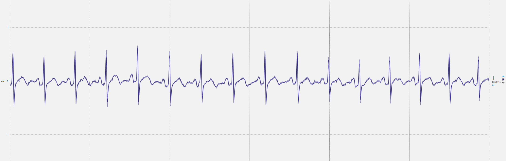 <em>Fig 2. Señal ECG en reposo, derivación DI, vista en OpenSignals.</em>

**DII:**

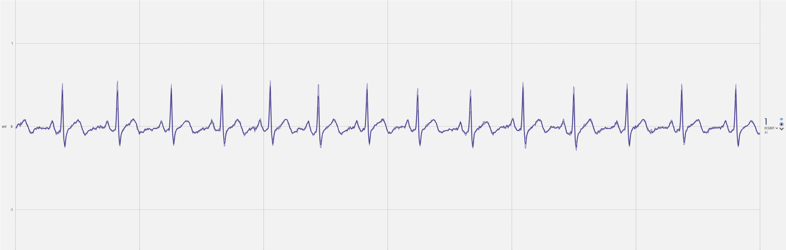 <em>Fig 3. Señal ECG en reposo, derivación DII, vista en OpenSignals.</em>

**DIII:**

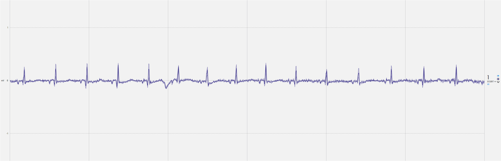 <em>Fig 4. Señal ECG en reposo, derivación DIII, vista en OpenSignals.</em>

## 5.2 Hiperventilación
 
**DI:**

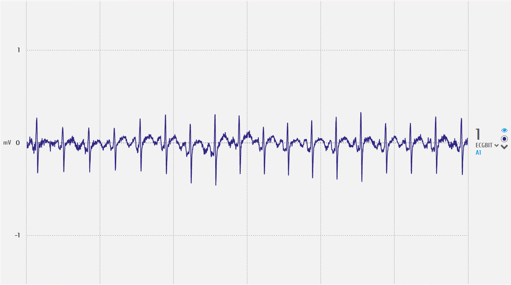 <em>Fig 5. Señal ECG durante hiperventilación, derivación DI, vista en OpenSignals.</em>

**DII:**

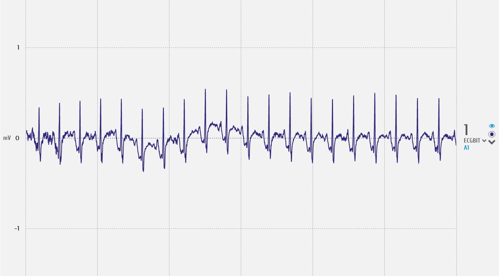 <em>Fig 6. Señal ECG durante hiperventilación, derivación DII, vista en OpenSignals.</em>

**DIII:**

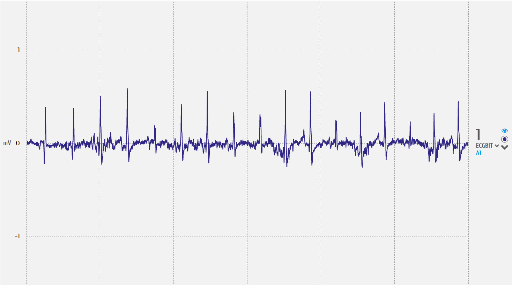 <em>Fig 7. Señal ECG durante hiperventilación, derivación DIII, vista en OpenSignals.</em>

## 5.3 Hipoventilación
 
**DI:**

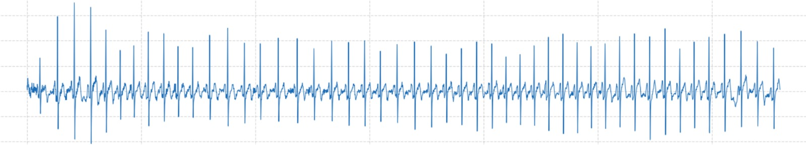 <em>Fig 8. Señal ECG durante hipoventilación, derivación DI, vista en OpenSignals.</em>

**DII:**

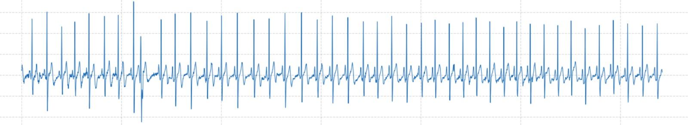 <em>Fig 9. Señal ECG durante hipoventilación, derivación DII, vista en OpenSignals.</em>

**DIII:**

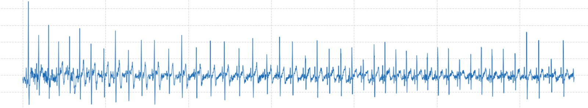 <em>Fig 10. Señal ECG durante hipoventilación, derivación DIII, vista en OpenSignals.</em>

## 5.4 Actividad aeróbica
 
**DI:**

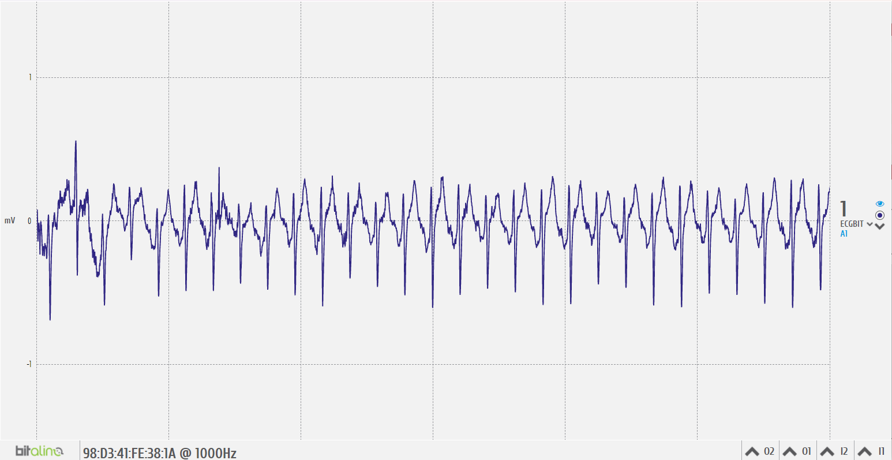 <em>Fig 11. Señal ECG tras actividad aeróbica, derivación DI, vista en OpenSignals.</em>

**DII:**

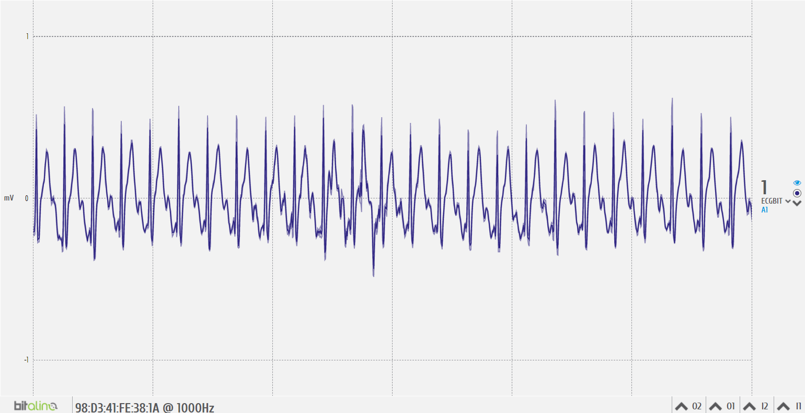 <em>Fig 12. Señal ECG tras actividad aeróbica, derivación DII, vista en OpenSignals.</em>

**DIII:**

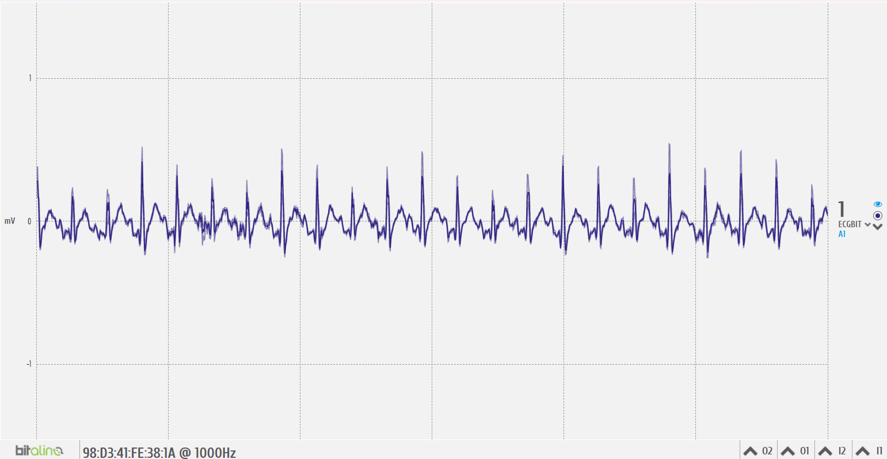 <em>Fig 13. Señal ECG tras actividad aeróbica, derivación DIII, vista en OpenSignals.</em>

# 6. Video de muestra
 
 Registro en vivo de la actividad eléctrica del corazón
 
[Ver video de muestra](https://drive.google.com/file/d/1EQ2QB8mGWPUM06r3pd5i2gLZVdr0OeQH/view?usp=drive_link)
 
# 7. Señal procesada en Python
 
## 7.1 Reposo
 
**DI:**

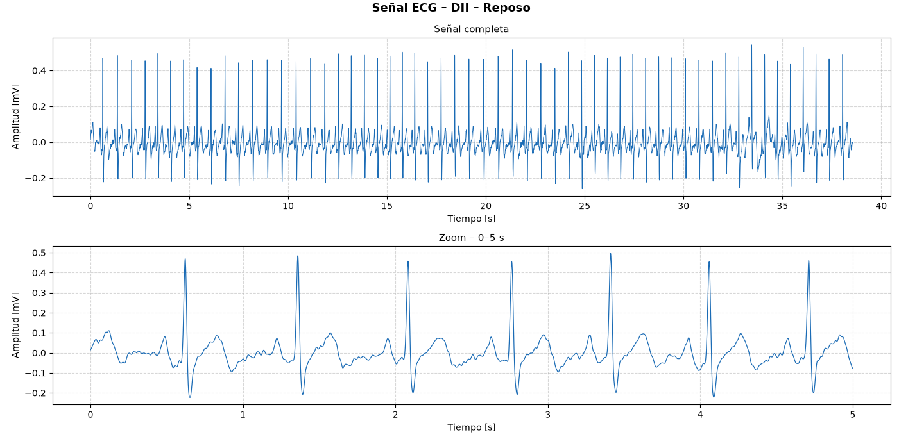 <em>Fig 14. Señal ECG en reposo, derivación DI, procesada en Python.</em>

DI – Reposo -> FC media: 91.9 bpm | Amplitud R: media 0.519 mV, máx 0.637 mV  (duración: 42.5 s, análisis desde 0 s)

**DII:**

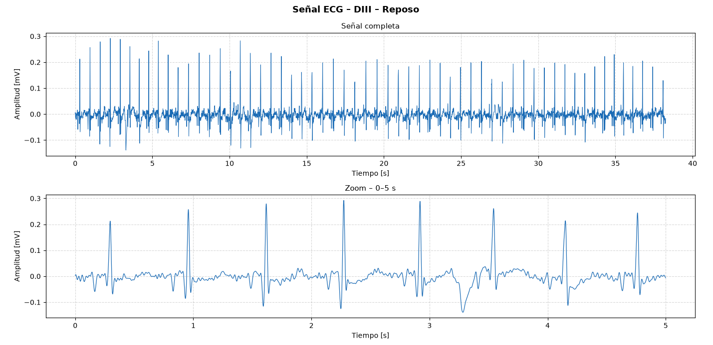 <em>Fig 15. Señal ECG en reposo, derivación DII, procesada en Python.</em>

DII – Reposo -> FC media: 88.4 bpm | Amplitud R: media 0.471 mV, máx 0.544 mV  (duración: 38.5 s, análisis desde 0 s)

**DIII:**

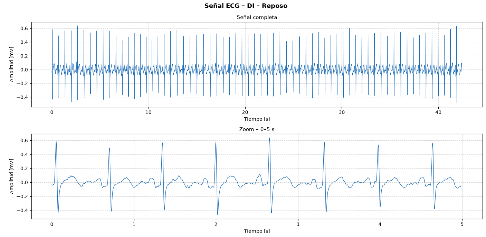 <em>Fig 16. Señal ECG en reposo, derivación DIII, procesada en Python.</em>

DIII – Reposo -> FC media: 90.7 bpm | Amplitud R: media 0.202 mV, máx 0.292 mV  (duración: 38.2 s, análisis desde 0 s)

## 7.2 Hiperventilación
 
**DI:**

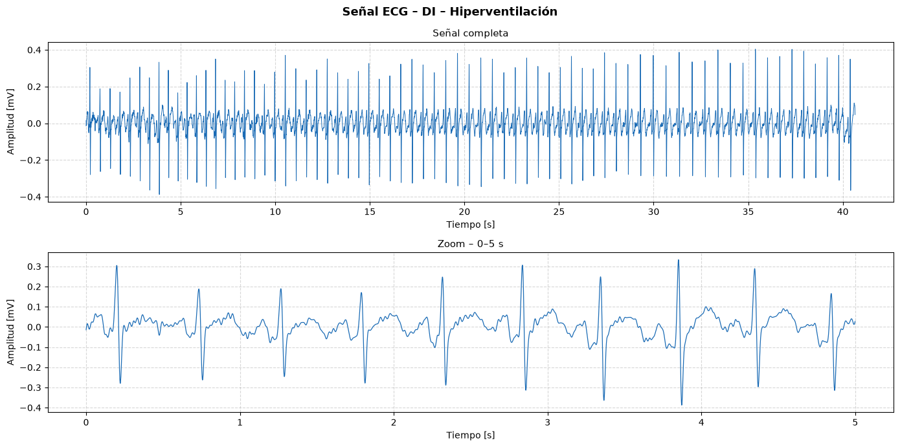 <em>Fig 17. Señal ECG durante hiperventilación, derivación DI, procesada en Python.</em>

DI – Hiperventilación -> FC media: 104.0 bpm | Amplitud R: media 0.308 mV, máx 0.404 mV  (duración: 40.6 s, análisis desde 0 s)

**DII:**

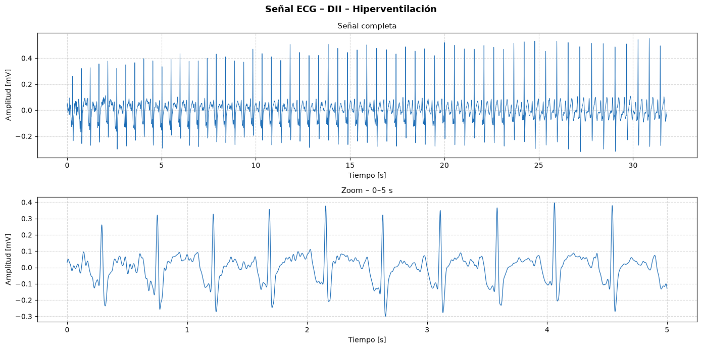 <em>Fig 18. Señal ECG durante hiperventilación, derivación DII, procesada en Python.</em>

DII – Hiperventilación -> FC media: 116.4 bpm | Amplitud R: media 0.443 mV, máx 0.552 mV  (duración: 31.8 s, análisis desde 0 s)

**DIII:**

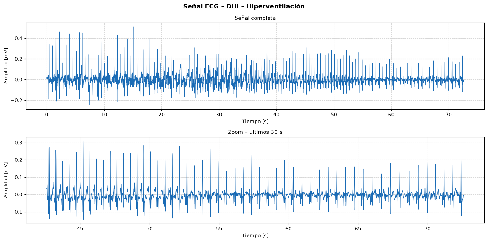 <em>Fig 19. Señal ECG durante hiperventilación, derivación DIII, procesada en Python.</em>

DIII – Hiperventilación -> FC media: 88.8 bpm | Amplitud R: media 0.285 mV, máx 0.512 mV  (duración: 72.6 s, análisis desde 0 s)

## 7.3 Hipoventilación
 
**DI:**

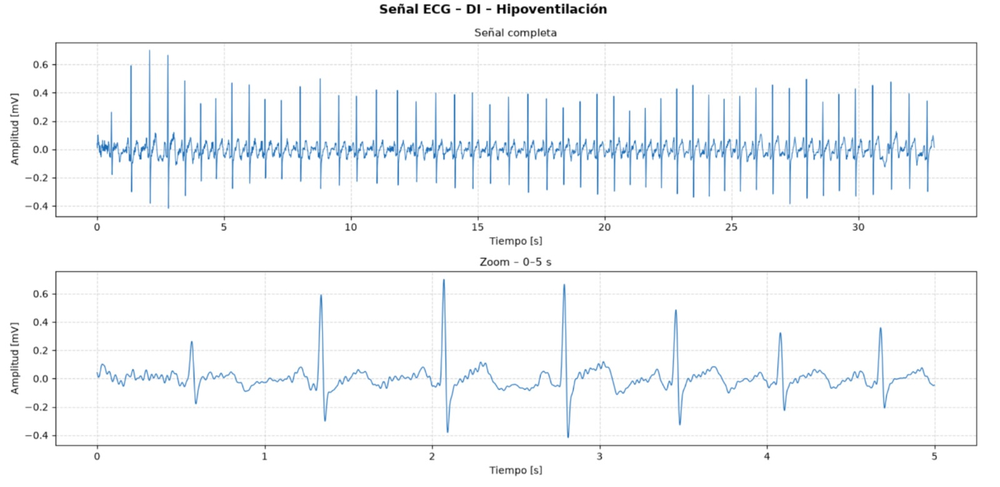 <em>Fig 20. Señal ECG durante hipoventilación, derivación DI, procesada en Python.</em>

**DII:**

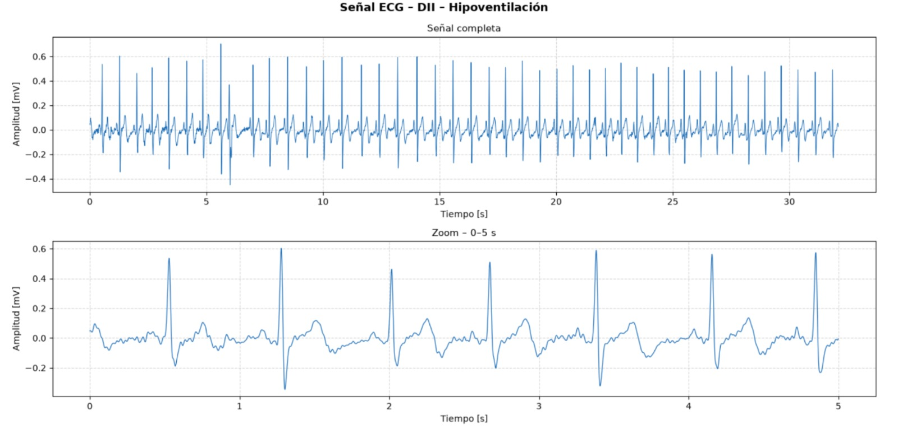 <em>Fig 21. Señal ECG durante hipoventilación, derivación DII, procesada en Python.</em>

**DIII:**

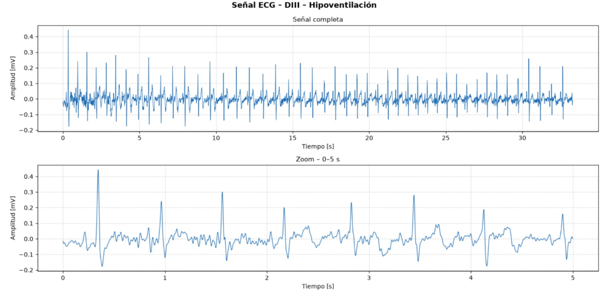 <em>Fig 22. Señal ECG durante hipoventilación, derivación DIII, procesada en Python.</em>

## 7.4 Actividad aeróbica
 
**DI:**

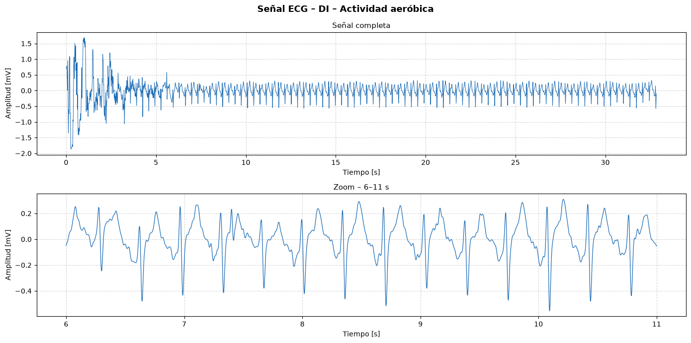 <em>Fig 23. Señal ECG tras actividad aeróbica, derivación DI, procesada en Python.</em>

DI – Actividad aeróbica -> FC media: 165.0 bpm | Amplitud R: media 0.253 mV, máx 0.325 mV  (duración: 32.9 s, análisis desde 7 s)

**DII:**

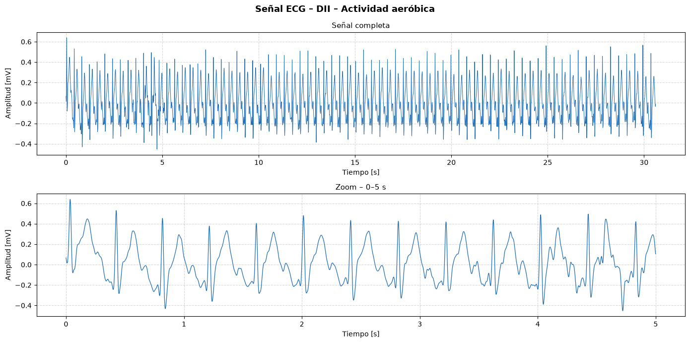 <em>Fig 24. Señal ECG tras actividad aeróbica, derivación DII, procesada en Python.</em>

DII – Actividad aeróbica -> FC media: 145.7 bpm | Amplitud R: media 0.457 mV, máx 0.567 mV  (duración: 30.6 s, análisis desde 5 s)

**DIII:**

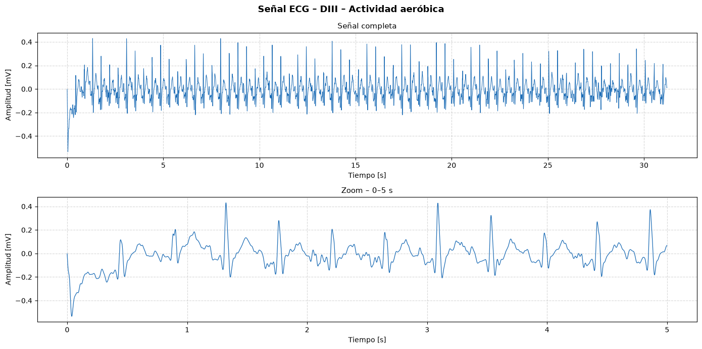 <em>Fig 25. Señal ECG tras actividad aeróbica, derivación DIII, procesada en Python.</em>

DIII – Actividad aeróbica -> FC media: 123.8 bpm | Amplitud R: media 0.296 mV, máx 0.429 mV  (duración: 31.2 s, análisis desde 5 s)

# 8. Análisis
 
## 8.1 Comparación entre derivaciones (DI, DII, DIII)

**Hiperventilación:**
Durante la hiperventilación la DII presentó la mayor frecuencia cardíaca media, con 116.4 bpm, y también la mayor amplitud media de la onda R, con 0.443 mV, seguida de DI con 104.0 bpm y 0.308 mV, mientras que DIII mostró 88.8 bpm y 0.285 mV. Además, en DIII se puede observar mayor variabilidad y ruido, posiblemente relacionado con el movimiento del tórax durante la respiración rápida y con pequeños cambios en el contacto de los electrodos. La guía indica que la respiración puede modificar la amplitud de los picos R y que el movimiento puede generar artefactos en la señal. Finalmente, al comparar la Ley de Einthoven (DI + DIII = 0.594 mV frente a DII = 0.443 mV) se obtuvo una diferencia de 0.150 mV, equivalente al 33.9 % de DII, la cual es una diferencia considerable; sin embargo, esto puede deberse a que las derivaciones fueron registradas en momentos distintos, además de posibles artefactos de movimiento y variaciones en la colocación de los electrodos.

**Actividad aeróbica:**
La frecuencia cardíaca medida después de realizar la actividad aeróbica dió resultados de 165.0 bpm en DI, 145.7 bpm en DII y 123.8 bpm en DIII. Se puede observar la curva de recuperación esperada, coincidiendo los valores con el orden de medición: DI (165.0) > DII (145.7) > DIII (123.8). La frecuencia cardiáca más alta se registra en la toma más cercana al inicio de la recuperación (DI) y la más baja en la última toma (DIII).
La amplitud media del pico R es de 0.253 mV en DI, 0.457 mV en DII y 0.296 mV en DIII, con una amplitud máxima cercana a la media en las tres derivaciones (0.325, 0.567 y 0.429 mV respectivamente), no hay picos de artefacto contaminando el cálculo.
La comprobación de la Ley de Einthoven (DI + DIII = 0.549 mV frente a DII = 0.457 mV, diferencia del 20.1%), la relacion entre derivaciones se mantiene cercana a lo esperado, la variación se puede atribuir a que los electrodos no ocupan exactamente los vértices ideales del triangulo y se registraron en diferentes momentos.
 
## 8.2 Comparación entre actividades (reposo, hiperventilación, hipoventilación, actividad aeróbica)
 
*[Completar: comparar frecuencia cardíaca (a partir de los intervalos R-R), presencia de artefactos de movimiento o ruido, y cualquier cambio visible en la morfología de la señal (p. ej. arritmia sinusal respiratoria durante hiperventilación, elevación de la frecuencia cardíaca tras la actividad aeróbica).]*
 
# 9. Respuestas al cuestionario
 
**1. ¿Cuáles son las fuentes de ruido más típicas que afectan al ECG?**
 
Las fuentes de ruido más típicas son la interferencia electromagnética (60Hz en Perú) y el fenómeno de ruido muscular, por eso buscamos colocar los electrodos en regiones de baja actividad muscular para reducir el ruido de las activaciones musuclares.
 
**2. ¿Por qué cambia la señal de ECG al cambiar la posición de los sensores (Lead I–III)? ¿Cómo cambian sus componentes?**
 
Porque cada derivación de Einthoven observa la actividad eléctrica del corazón desde un ángulo diferente: DI registra de brazo derecho a brazo izquierdo, DII de brazo derecho a pierna izquierda y DIII de brazo izquierdo a pierna izquierda. Por ello, aunque la actividad cardíaca sea la misma, las ondas P, QRS y T pueden cambiar principalmente en amplitud y polaridad.
 
**3. Describe si hay diferencias importantes en la señal al adquirirla desde distintas ubicaciones corporales (p. ej. muñeca/clavícula/pecho). ¿Cuál podría ser la causa? ¿Esperabas estos cambios?**
 
Sí se esperan diferencias al registrar el ECG en distintas ubicaciones del cuerpo. La señal tomada cerca del corazón, especialmente en el pecho, suele ser más clara y permite distinguir mejor los complejos P-QRS-T, mientras que en muñecas o clavículas la señal puede presentar menor claridad o mayor interferencia. Esto ocurre porque la ubicación de los electrodos modifica cómo se capta la actividad eléctrica cardíaca y porque el movimiento muscular puede introducir artefactos. Por ello, era esperable encontrar cambios entre las señales obtenidas en pecho, clavículas y muñecas.
 
**4. Los sistemas cardíaco y respiratorio están interconectados. ¿Esperas que distintos tipos de respiración (más rápida, más profunda) influyan en la señal de ECG? Muestra capturas de las señales en las distintas circunstancias respiratorias y describe las variaciones si las hay.**
 
*[Respuesta]*
 
**5. En el Home-Guide #1 (EMG) se vio que distintos niveles de fuerza generan distintas amplitudes en la señal muscular. ¿Cómo influye el movimiento en la señal de ECG?**
 
*[Respuesta]*
 
**6. Según lo aprendido, ¿cómo se puede detectar bradicardia y taquicardia en la señal de ECG?**
 
*[Respuesta]*
 
# 10. Referencias
 
- PLUX Wireless Biosignals. *BITalino (r)evolution Home Guide #2 — Electrocardiography (ECG)*. OD.LB.03.04, 2021.
- Meza, M.; Cáceres, J.A. *Electrocardiograma: Anatomía del corazón, Ondas del ECG, Derivaciones, Características y Arritmias* (material de clase, Introducción a Señales Biomédicas).
- 
