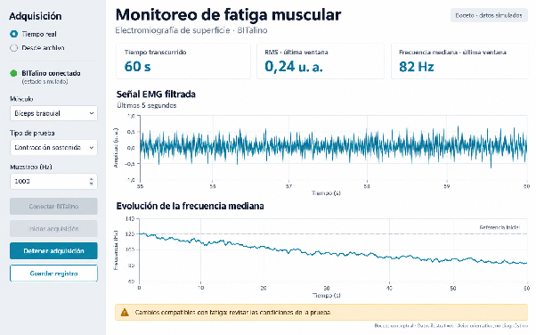

<h1 align="center">Detector de Fatiga Muscular con EMG</h1>

<em>Laboratorio 5: Introducción a Señales Biomédicas · Avance 1 del proyecto final</em>

**Integrantes:** 

*- Solangel Macedo Pereira*

*- Astrid Mejía Barreto*

*- Geraldine Segura Villarreal*

*- José Vera Meza*

**Video de presentación:** 📹 *[Insertar enlace de YouTube o Drive]*

**Base de datos:** Las señales serán adquiridas por el grupo con BITalino.

## Índice

- [1. Planteamiento del problema](#1-planteamiento-del-problema)
- [2. Paper de referencia](#2-paper-de-referencia)
  - [2.1 Indicadores utilizados para el proyecto](#21-indicadores-utilizados-para-el-proyecto)
  - [2.2 Análisis conjunto de amplitud y espectro (JASA)](#22-análisis-conjunto-de-amplitud-y-espectro-jasa)
- [3. Propuesta de solución](#3-propuesta-de-solución)
- [4. Boceto del dashboard](#4-boceto-del-dashboard)
- [5. Plan de trabajo](#5-plan-de-trabajo)
- [6. Referencias](#6-referencias)

# 1. Planteamiento del problema

En el ámbito deportivo, la fatiga muscular es uno de los factores de riesgo más comunes, especialmente para los atletas. Se trata de un fenómeno fisiológico en el que la capacidad muscular se reduce progresivamente para generar y mantener fuerza. En este contexto, la fatiga muscular se asocia a lesiones debido al sobreuso muscular o incluso a caídas en el rendimiento durante esfuerzos sostenidos [1].

En la actualidad, la medición de la fatiga muscular se realiza a partir de la percepción subjetiva de la persona o mediante la interrupción de la actividad física cuando esta se siente cansada. Sin embargo, esto implica que los procesos de fatiga metabólica y neuromuscular ya llevaban tiempo desarrollándose de forma silenciosa. Como consecuencia, se retrasa la posibilidad de intervenir con antelación para ajustar los ejercicios realizados y evitar el riesgo de lesión.

Debido a esto, la electromiografía de superficie (sEMG) se considera una metodología no invasiva capaz de detectar la fatiga antes de que sea percibida, a partir de cambios espectrales y de amplitud en la señal muscular [1], [2], [3]. No obstante, esta práctica depende de procedimientos fuera de línea o de interfaces poco accesibles para la persona. Esto deja una brecha para el desarrollo de un dispositivo que muestre la fatiga muscular en vivo y que resulte comprensible para el usuario.

# 2. Paper de referencia

**Cifrek, M., Medved, V., Tonković, S., & Ostojić, S. (2009).** Surface EMG based muscle fatigue evaluation in biomechanics. *Clinical Biomechanics, 24*(4), 327–340. https://doi.org/10.1016/j.clinbiomech.2009.01.010

El paper citado refiere a un artículo de revisión del estado del arte sobre los métodos de procesamiento de la señal EMG de superficie (sEMG) aplicados durante la evaluación de fatiga muscular local en biomecánica. Parte de una limitación de los métodos tradicionales: medir el tiempo hasta el agotamiento o la concentración de lactato no detecta la fatiga durante el proceso, sino una vez ocurrida, o no permite monitorearla en tiempo real y refleja la fatiga global del organismo, no la de un músculo en específico.

El sEMG es un método no invasivo, se aplica in situ y permite monitorear, en un músculo en particular, la fatiga en tiempo real. Durante una contracción sostenida aumenta la concentración de lactato y disminuye el pH intracelular, lo que reduce la velocidad de conducción de las fibras musculares y modifica la forma de los potenciales de acción de las unidades motoras, haciendo que el espectro de potencia se desplace hacia frecuencias más bajas y la amplitud aumente. Esto se explica debido a que el tejido actúa como un filtro pasa-bajos espacial que permite llegar más energía a los electrodos de superficie.

## 2.1 Indicadores utilizados para el proyecto

- **Amplitud (RMS):** la amplitud se estima mediante el valor RMS en el dominio del tiempo. Se menciona que es inusual usarlo de forma aislada y se complementa con el análisis espectral.
- **Frecuencia media (MNF) y frecuencia mediana (MDF):** se utilizan para cuantificar el espectro en el dominio de la frecuencia y se definen como:

$$MNF = \frac{\int_0^{f_s/2} f\,P(f)\,df}{\int_0^{f_s/2} P(f)\,df} \qquad \int_0^{MDF} P(f)\,df = \frac{1}{2}\int_0^{f_s/2} P(f)\,df$$

  donde $P(f)$ es la densidad espectral de potencia y $f_s$ la frecuencia de muestreo. Dado que la señal cambia con la fatiga, estos parámetros deben calcularse por ventanas.
- **Análisis por ventanas:** en contracciones isométricas la señal puede comportarse como estacionaria en segmentos de 0.5 a 2 s, lo que justifica calcular el espectro por ventanas.
- **Índice de fatiga:** pendiente de la recta de regresión ajustada a la evolución de la MDF, expresada en Hz/min.

## 2.2 Análisis conjunto de amplitud y espectro (JASA)

El análisis conjunto de amplitud y espectro (JASA) permite distinguir si un cambio en la señal se debe a la fuerza o a la fatiga:

| Amplitud | Espectro | Interpretación |
|---|---|---|
| Aumenta | Se desplaza a la derecha | Aumento de fuerza |
| Disminuye | Se desplaza a la izquierda | Disminución de fuerza |
| Aumenta | Se desplaza a la izquierda | Fatiga |
| Disminuye | Se desplaza a la derecha | Recuperación |

Nuestro detector usará RMS, MNF y MDF calculados por ventanas durante una contracción de carga constante, y la regla JASA para poder distinguir cambios de fuerza de la fatiga. Los autores concluyen que aún está pendiente un monitor de fatiga portátil que integre varios índices, que es la línea en la que se ubica nuestra propuesta.

# 3. Propuesta de solución

La propuesta de solución consiste en desarrollar un sistema capaz de adquirir y procesar señales electromiográficas de superficie (sEMG) para identificar cambios asociados con la fatiga muscular durante la realización de una actividad física. La señal será obtenida mediante el dispositivo BITalino, utilizando electrodos colocados sobre el músculo evaluado. Posteriormente, la información adquirida será enviada a una computadora para realizar su procesamiento y visualización.

Debido a que la señal obtenida directamente puede contener ruido, interferencias eléctricas o movimientos producidos durante el ejercicio, se realizará una etapa de filtrado digital antes de analizarla. De esta manera, se buscará conservar principalmente la información asociada con la actividad muscular y obtener una señal más adecuada para el cálculo de sus características. Luego, la señal será analizada mediante ventanas de tiempo, a partir de las cuales se calcularán características relacionadas con la amplitud y el contenido frecuencial. Entre los principales parámetros se utilizarán el valor RMS, como indicador de la amplitud de la actividad muscular, y la frecuencia mediana del espectro, debido a que ambos parámetros permiten observar cambios que pueden presentarse conforme aumenta la fatiga muscular.

Finalmente, los resultados serán mostrados en un dashboard web que permitirá visualizar en tiempo real la señal EMG filtrada, los indicadores obtenidos y su evolución durante la prueba. Además, se incluirá un sistema de aviso cuando los parámetros presenten cambios compatibles con fatiga muscular según los criterios definidos durante las pruebas piloto. Este aviso tendrá únicamente un carácter orientativo y no buscará realizar un diagnóstico médico ni indicar un porcentaje exacto de fatiga. De esta manera, la propuesta busca presentar la información obtenida de la señal EMG de una forma sencilla y comprensible para el usuario.

# 4. Boceto del dashboard

Se propone desarrollar un dashboard web para visualizar la señal electromiográfica adquirida mediante BITalino y observar la evolución de sus características durante una prueba muscular. La interfaz permitirá consultar el registro y sus indicadores de manera organizada, facilitando el seguimiento de cambios que puedan estar asociados con la fatiga muscular.

El boceto contempla una pantalla principal con los siguientes componentes:

- **Panel de registro:** mostrará el estado de conexión con BITalino, el músculo evaluado y el tiempo transcurrido. Incluirá controles para iniciar y detener la adquisición de datos.
- **Gráfico de la señal EMG:** presentará la señal filtrada en función del tiempo, con sus respectivos ejes y unidades. Permitirá observar los periodos de actividad muscular y reconocer alteraciones evidentes del registro que requieran revisión.
- **Indicadores de amplitud y frecuencia:** mostrará el valor RMS, que resume la amplitud de la señal, y la frecuencia mediana, que divide la potencia del espectro en dos partes iguales. Ambos indicadores se calcularán por ventanas de análisis y se actualizarán durante la sesión. Su inclusión se sustenta en investigaciones que utilizan características temporales y espectrales de la sEMG para estudiar cambios asociados con la fatiga muscular [2], [3].
- **Gráfico de tendencia:** mostrará la evolución de la frecuencia mediana durante la prueba y permitirá compararla con un valor de referencia obtenido al inicio, durante un periodo válido de contracción. Esto facilitará visualizar cambios progresivos, cuya interpretación dependerá de las condiciones del ejercicio y de la calidad de la señal.
- **Panel de aviso:** mostrará un mensaje de cambios compatibles con fatiga muscular cuando se cumplan los criterios definidos para el proyecto. Estos criterios se establecerán y evaluarán mediante pruebas piloto. El aviso tendrá carácter orientativo y no representará un diagnóstico ni un porcentaje exacto de fatiga.

Los controles de conexión y adquisición se ubicarán en la barra lateral. En la parte superior del área principal se mostrarán el tiempo transcurrido, el RMS y la frecuencia mediana. Debajo se presentarán la señal EMG filtrada, la evolución de la frecuencia mediana y el aviso orientativo. Se utilizarán etiquetas claras, unidades de medida y mensajes breves para facilitar la interpretación.

En esta etapa, el boceto representará el diseño y las funciones previstas del dashboard. Los valores y trazados empleados serán ilustrativos. La selección definitiva de indicadores y criterios de aviso se ajustará al protocolo de adquisición y al procesamiento establecido en la propuesta de solución.

 <em>Fig 1. Boceto preliminar del dashboard para visualizar la señal sEMG y sus indicadores durante una prueba muscular. Elaboración propia; valores y trazados ilustrativos.</em>

# 5. Plan de trabajo

| Hito | Fecha | Actividades |
|---|---|---|
| Exposición: revisión de Avance 2 | 9 de octubre | Configuración del BITalino y primeras pruebas piloto. Avance del proceso de filtrado. |
| Exposición: revisión de Avance 3 | 27 de noviembre | Implementación completa de los filtros. Construcción del dashboard web. |
| Feria de pósters (Avance 4) | Diciembre | Validación con pruebas piloto adicionales. Diseño del póster. Ensayo de la exposición. |

# 6. Referencias

[1] M. Z. C. Azman, M. A. Mat Jusoh, and N. S. Khusaini, "Detection of Localized Muscle Fatigue by Using Wireless EMG Among Track and Field Athletes," in *Innovation and Technology in Sports*, Lecture Notes in Bioengineering. Singapore: Springer, 2023, pp. 259–268, doi: 10.1007/978-981-99-0297-2_21.

[2] D. Miaoulis, I. Stivaros, and S. Koubias, "Developing a Novel Muscle Fatigue Index for Wireless sEMG Sensors: Metrics and Regression Models for Real-Time Monitoring," *Electronics*, vol. 14, no. 11, p. 2097, 2025, doi: 10.3390/electronics14112097.

[3] S.-H. Liu, C.-B. Lin, Y. Chen, W. Chen, T.-S. Huang, and C.-Y. Hsu, "An EMG Patch for the Real-Time Monitoring of Muscle-Fatigue Conditions During Exercise," *Sensors*, vol. 19, no. 14, p. 3108, 2019, doi: 10.3390/s19143108.

[4] M. Cifrek, V. Medved, S. Tonković, and S. Ostojić, "Surface EMG based muscle fatigue evaluation in biomechanics," *Clinical Biomechanics*, vol. 24, no. 4, pp. 327–340, 2009, doi: 10.1016/j.clinbiomech.2009.01.010.