<h1 align="center">Electroencefalografía (EEG)</h1>

<em>Laboratorio 6: Introducción a Señales Biomédicas</em>

## Índice

- [1. Introducción](#1-introducción)
- [2. Materiales](#2-materiales)
- [3. Procedimiento](#3-procedimiento)
  - [3.1 Configuración experimental](#31-configuración-experimental)
  - [3.2 Control del entorno](#32-control-del-entorno)
  - [3.3 Fases de la dinámica](#33-fases-de-la-dinámica)
- [4. Señal en OpenSignals](#4-señal-en-opensignals)
  - [4.1 Lectura basal](#41-lectura-basal)
  - [4.2 Apertura y cierre de ojos](#42-apertura-y-cierre-de-ojos)
  - [4.3 Mirada fija en un punto](#43-mirada-fija-en-un-punto)
  - [4.4 Preguntas de dificultad variable](#44-preguntas-de-dificultad-variable)
  - [4.5 Música lofi y música estruendosa](#45-música-lofi-y-música-estruendosa)
- [5. Señal procesada en Python](#5-señal-procesada-en-python)
  - [5.1 Lectura basal](#51-lectura-basal)
  - [5.2 Apertura y cierre de ojos](#52-apertura-y-cierre-de-ojos)
  - [5.3 Mirada fija en un punto](#53-mirada-fija-en-un-punto)
  - [5.4 Preguntas de dificultad variable](#54-preguntas-de-dificultad-variable)
  - [5.5 Música lofi y música estruendosa](#55-música-lofi-y-música-estruendosa)
- [6. Análisis](#6-análisis)
  - [6.1 Lectura basal](#61-lectura-basal)
  - [6.2 Apertura y cierre de ojos](#62-apertura-y-cierre-de-ojos)
  - [6.3 Mirada fija en un punto](#63-mirada-fija-en-un-punto)
  - [6.4 Preguntas de dificultad variable](#64-preguntas-de-dificultad-variable)
  - [6.5 Música lofi y música estruendosa](#65-música-lofi-y-música-estruendosa)
  - [6.6 Comparación general](#66-comparación-general)
- [7. Respuestas al cuestionario](#7-respuestas-al-cuestionario)
- [8. Referencias](#8-referencias)

# 1. Introducción

La electroencefalografía (EEG) registra la actividad eléctrica del cerebro mediante electrodos colocados sobre el cuero cabelludo. La señal proviene principalmente de las neuronas piramidales de la corteza, cuya orientación perpendicular a la superficie cortical hace que sus potenciales postsinápticos sean lo bastante intensos como para detectarse desde el cuero cabelludo. Por ello, cada electrodo refleja la actividad de la región cerebral que tiene debajo.

La señal EEG se analiza por bandas de frecuencia:

| Banda | Frecuencia (Hz) | Asociación típica |
|-------|-----------------|-------------------|
| Delta | 0 – 4 | Sueño profundo |
| Theta | 4 – 8 | Somnolencia, carga cognitiva (p. ej. tarea N-back) |
| Alpha | 8 – 12 | Relajación con ojos cerrados; se suprime al abrir los ojos o con actividad mental |
| Beta | 12 – 25 | Mente activa, concentración |
| Gamma | > 25 | Resolución de problemas, concentración |

Las posiciones de los electrodos se describen con el **sistema internacional 10-20**, donde la letra indica el lóbulo (F: frontal, T: temporal, C: central, P: parietal, O: occipital), los números impares corresponden al hemisferio izquierdo, los pares al derecho y la "z" a la línea media.

**Objetivos del laboratorio:**

- Realizar adquisiciones EEG en tiempo real con el sistema BITalino.
- Observar cómo cambia la señal según el estado o la tarea (ojos abiertos/cerrados, carga cognitiva, estímulo auditivo).
- Familiarizarse con las bandas de frecuencia de interés, en particular alpha y beta.
- Identificar los artefactos que afectan al registro y cómo minimizarlos.

# 2. Materiales

- Software OpenSignals (r)evolution
- BITalino (r)evolution Core BT
- Sensor EEG ensamblado (configuración bipolar, pines IN+ e IN−)
- Electrodos autoadhesivos desechables de Ag/AgCl con gel (2 para el sensor, 1 para la referencia)
- Antifaz/gafas para cubrir los ojos, audífonos

# 3. Procedimiento

## 3.1 Configuración experimental

1. Se conectó el BITalino Core BT a OpenSignals (r)evolution y se verificó la conexión.
2. Se conectaron el sensor EEG y el cable de referencia a dos canales analógicos.
3. Se limpió la piel con alcohol para retirar partículas y mejorar la conductividad, y se colocaron los electrodos con gel en los dos snaps del sensor y en la referencia.
4. El sensor se ubicó en la frente, sobre la posición [FP1 / FP2 / O2: completar] del sistema 10-20, y la referencia sobre una zona ósea detrás de la oreja.

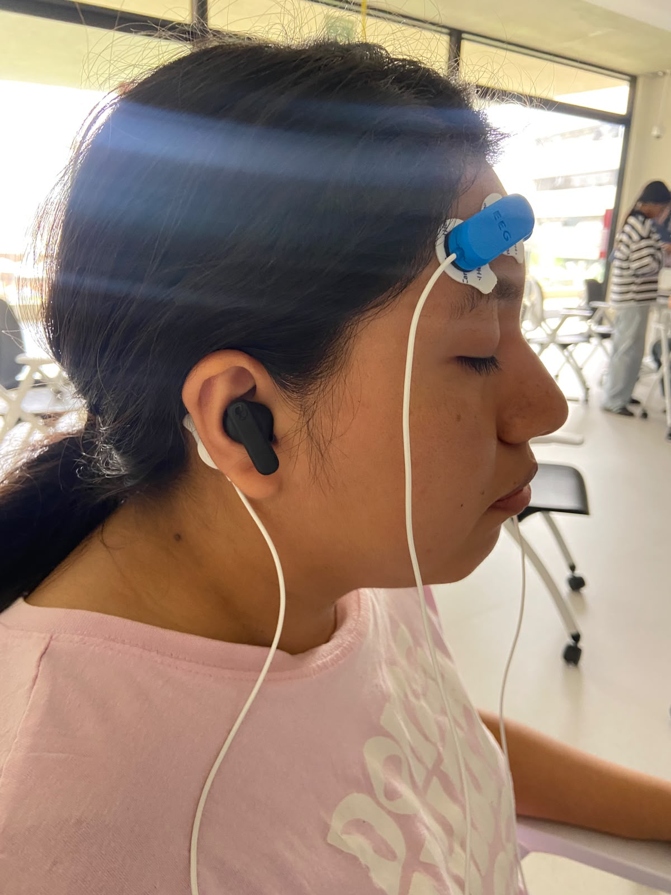 <em>Fig 1. Imagen de Frente. Colocación de los electrodos del sensor EEG en la frente y de la referencia detrás de la oreja.</em>

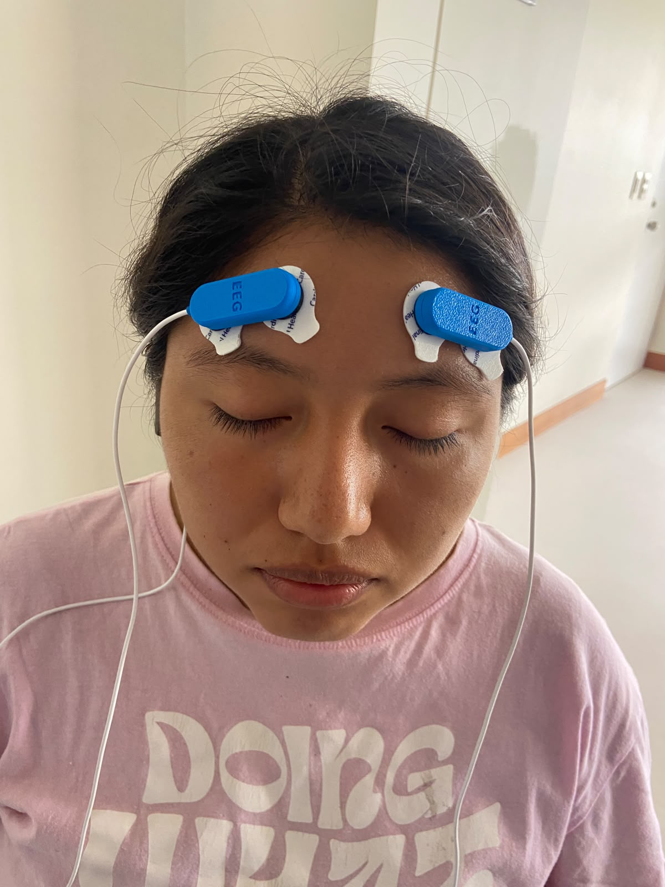 <em>Fig 2. Imagen de perfil. Colocación de los electrodos del sensor EEG en la frente y de la referencia detrás de la oreja.</em>

## 3.2 Control del entorno

Dado que la señal es muy sensible a artefactos, se tomaron estas medidas:

- Se apagaron las luces y el participante se ubicó de espaldas a la fuente de luz, para eliminar estímulos visuales externos. Asimismo, se le taparon los ojos y se le colocaron audífonos en los oídos.
- El participante no habló ni movió la boca o la mandíbula, evitando artefactos EMG.
- Se evitaron movimientos oculares rápidos y parpadeos.

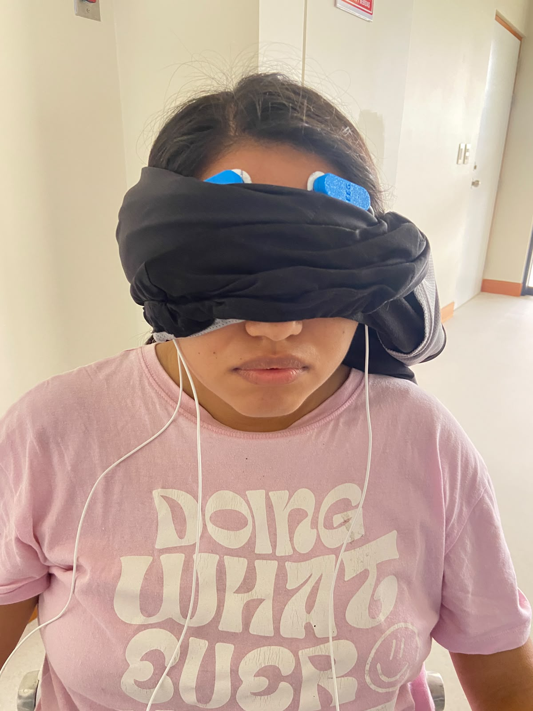 <em>Fig 3. Imagen de Frente. Participante con los ojos vendados y audífonos colocados durante el registro.</em>

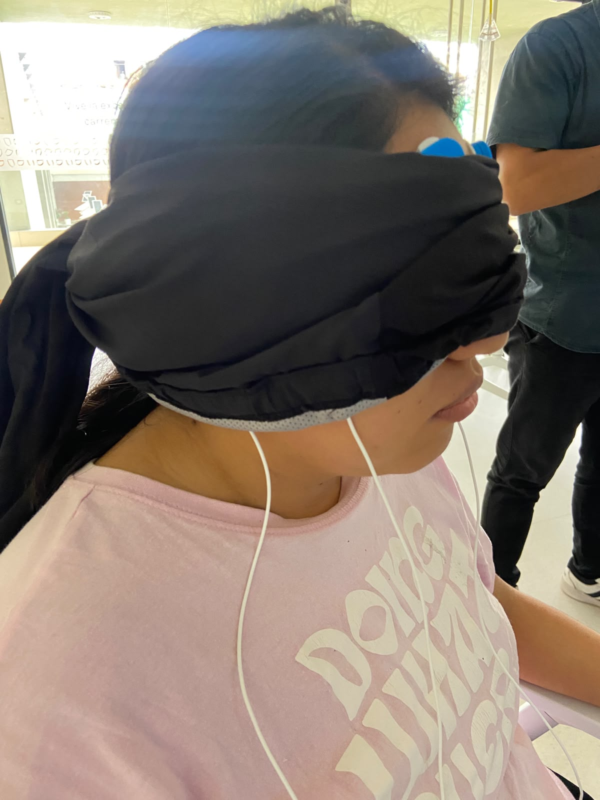 <em>Fig 4. Imagen de Perfil. Participante con los ojos vendados y audífonos colocados durante el registro.</em>

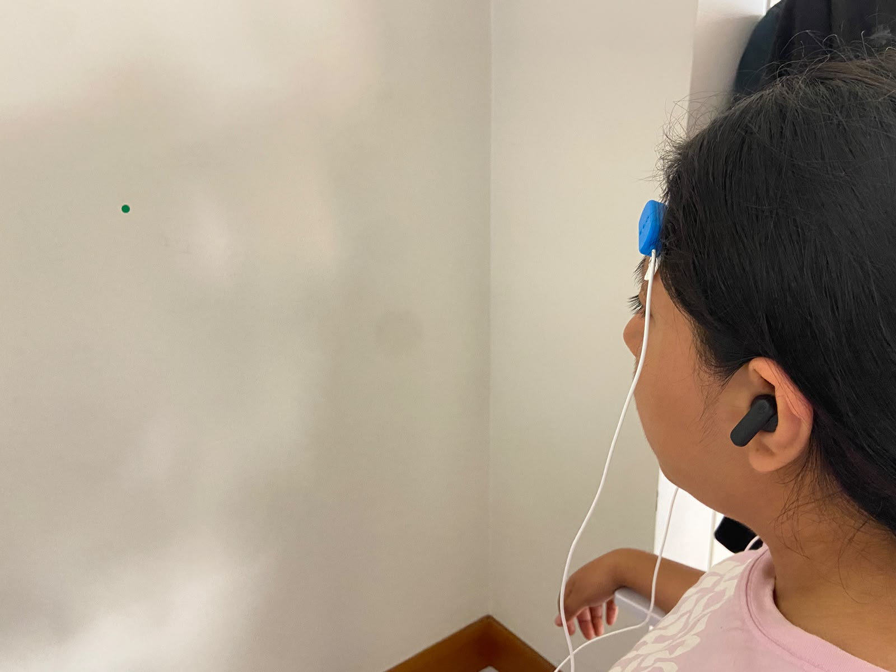 <em>Fig 5. Participante durante la actividad de mirar un punto fijo</em>

## 3.3 Fases de la dinámica

| Fase | Descripción |
|------|-------------|
| Lectura basal | Registro en reposo, ojos cerrados, sin movimiento, audífonos colocados |
| Apertura y cierre de ojos | 5 ciclos de 5 s por estado, ojos tapados, audífonos colocados |
| Mirada fija en un punto | 30 s, ojos destapados, audífonos colocados |
| Preguntas de dificultad variable | Preguntas susurradas (nivel universitario y luego fáciles), 1 oreja libre |
| Música | Lofi vs. música estruendosa (1–1:30 min por canción), ojos tapados, audífonos colocados |

# 4. Señal en OpenSignals

## 4.1 Lectura basal

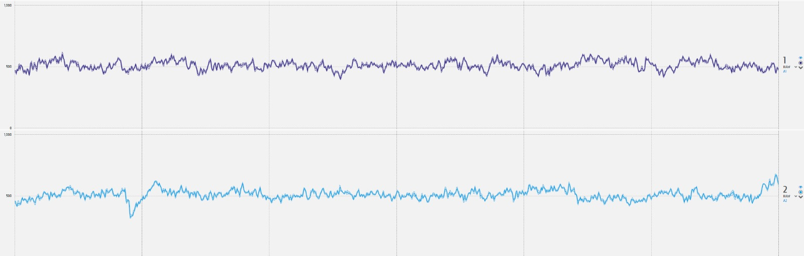 <em>Fig 6. Señal EEG en lectura basal, vista en OpenSignals.</em>

## 4.2 Apertura y cierre de ojos

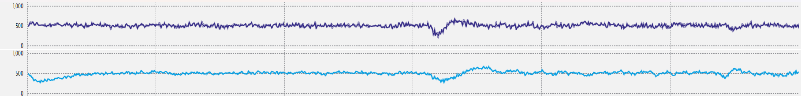 <em>Fig 7. Señal EEG durante la apertura y cierre de ojos (5 ciclos de 5 s), vista en OpenSignals.</em>

## 4.3 Mirada fija en un punto

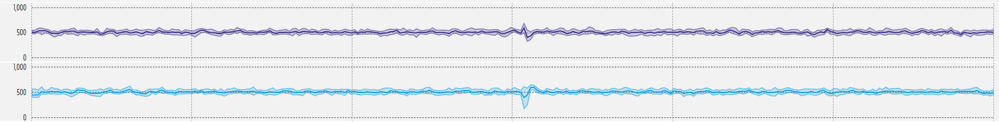 <em>Fig 8. Señal EEG durante 30 s de mirada fija en un punto, vista en OpenSignals.</em>

## 4.4 Preguntas de dificultad variable

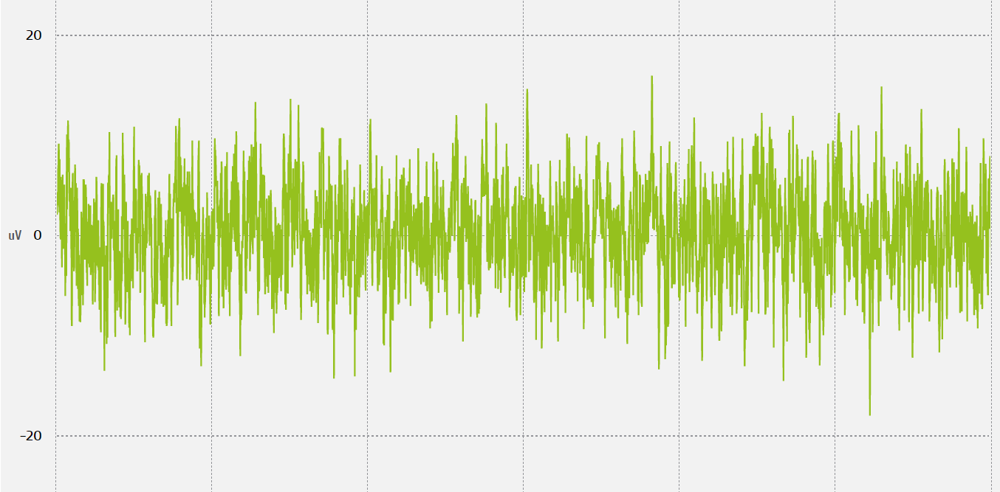 <em>Fig 9. Señal EEG durante las preguntas de nivel universitario, vista en OpenSignals.</em>

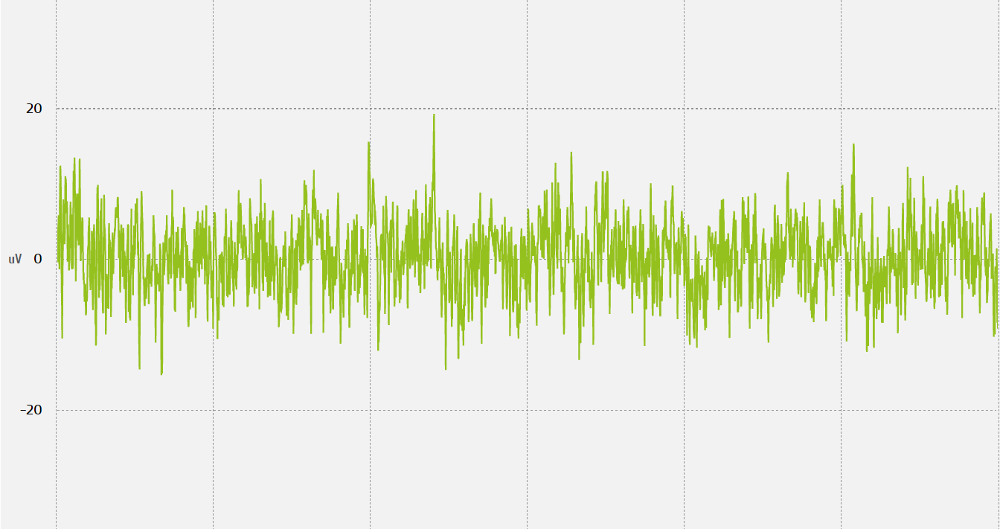 <em>Fig 10. Señal EEG durante las preguntas fáciles, vista en OpenSignals.</em>

## 4.5 Música lofi y música estruendosa

 <em>Fig 11. Señal EEG durante música lofi, vista en OpenSignals.</em>

 <em>Fig 12. Señal EEG durante música estruendosa, vista en OpenSignals.</em>

# 5. Señal procesada en Python

## 5.1 Lectura basal

**Tiempo**

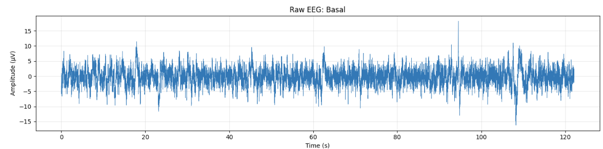 <em>Fig 13. Señal EEG en lectura basal, amplitud vs. tiempo, procesada en Python.</em>

**Espectrograma**

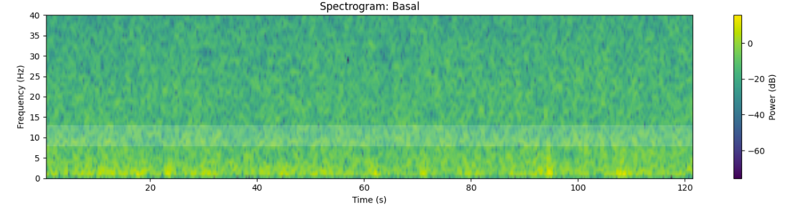 <em>Fig 14. Señal EEG en lectura basal, espectrograma, procesada en Python.</em>

## 5.2 Apertura y cierre de ojos

**Tiempo**

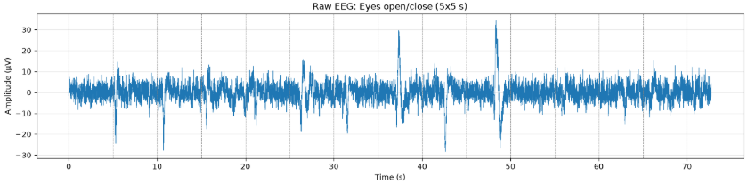 <em>Fig 15. Señal EEG durante la apertura y cierre de ojos, amplitud vs. tiempo, procesada en Python. Las líneas marcan intervalos de 5 s como referencia aproximada de cada estado.</em>

**Espectrograma**

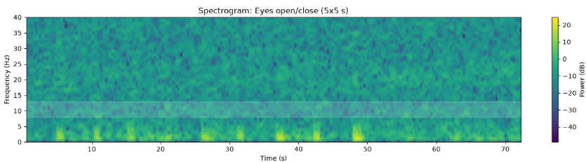 <em>Fig 16. Señal EEG durante la apertura y cierre de ojos, espectrograma (0–40 Hz), procesada en Python. La franja resaltada corresponde a la banda alpha.</em>

## 5.3 Mirada fija en un punto

**Tiempo**

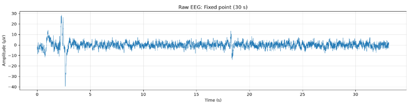 <em>Fig 17. Señal EEG durante la mirada fija en un punto, amplitud vs. tiempo, procesada en Python.</em>

**Espectrograma**

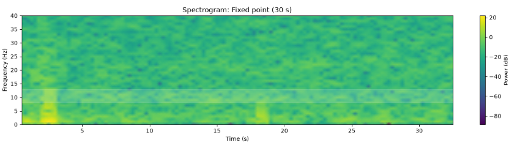 <em>Fig 18. Señal EEG durante la mirada fija en un punto, espectrograma (0–40 Hz), procesada en Python.</em>

## 5.4 Preguntas de dificultad variable

**Tiempo**

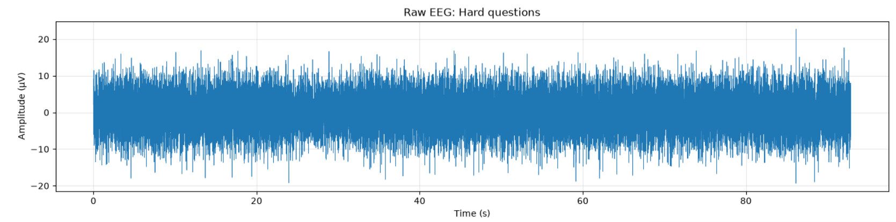 <em>Fig 19. Señal EEG durante las preguntas de nivel universitario, amplitud vs. tiempo, procesada en Python.</em>

**Espectrograma**

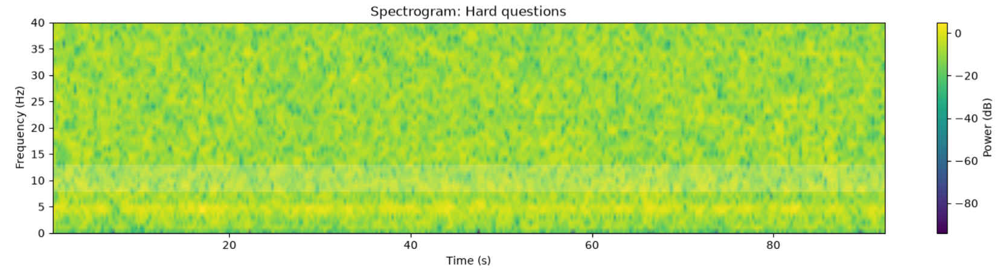 <em>Fig 20. Señal EEG durante las preguntas de nivel universitario, espectrograma, procesada en Python.</em>

**Tiempo**

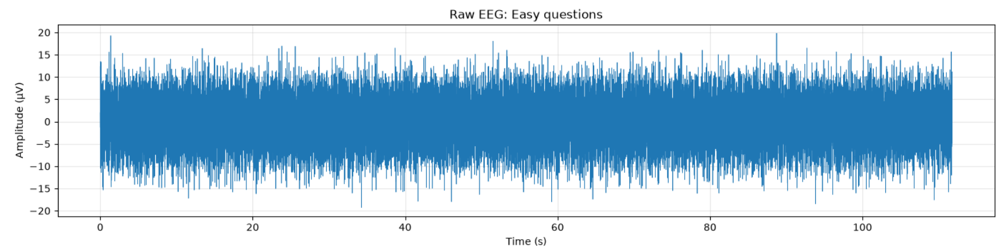 <em>Fig 21. Señal EEG durante las preguntas fáciles, amplitud vs. tiempo, procesada en Python.</em>

**Espectrograma**

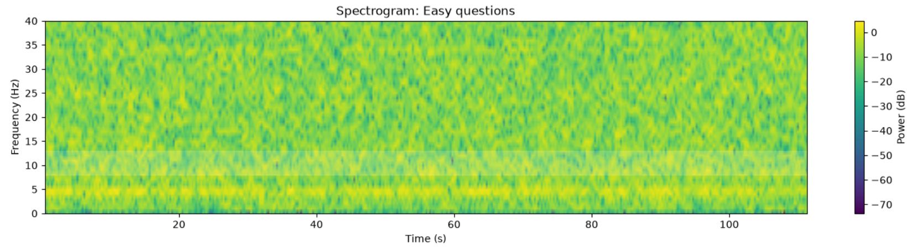 <em>Fig 22. Señal EEG durante las preguntas fáciles, espectrograma, procesada en Python.</em>

## 5.5 Música lofi y música estruendosa

**Tiempo**

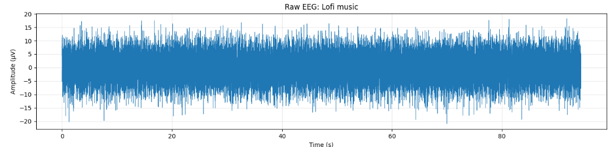 <em>Fig 23. Señal EEG durante música lofi, amplitud vs. tiempo, procesada en Python.</em>

**Espectrograma**

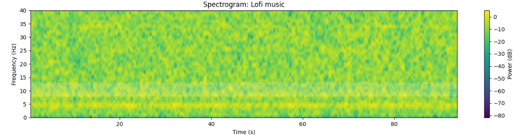 <em>Fig 24. Señal EEG durante música lofi, espectrograma, procesada en Python.</em>

**Tiempo**

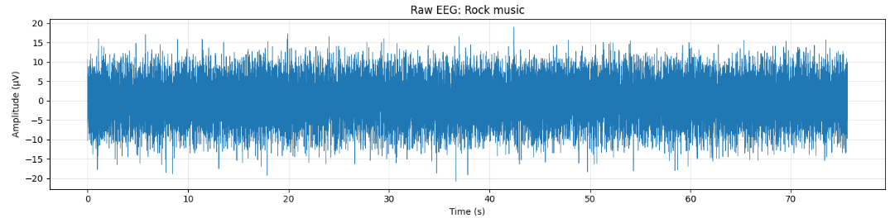 <em>Fig 25. Señal EEG durante música estruendosa, amplitud vs. tiempo, procesada en Python.</em>

**Espectrograma**

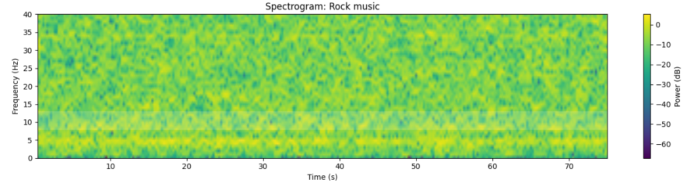 <em>Fig 26. Señal EEG durante música estruendosa, espectrograma, procesada en Python.</em>

# 6. Análisis

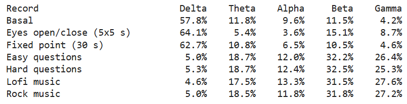 <em>Fig 27. Densidad espectral de potencia (Welch) de las señales, procesada en Python.</em>

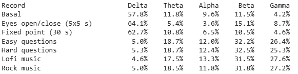 <em>Fig 28. Porcentaje de potencia por banda en cada señal, procesada en Python.</em>

## 6.1 Lectura basal

En esta parte de la actividad se registró al participante en reposo, con los ojos cerrados y tapados, sin hablar ni mover la boca, con las luces apagadas y los audífonos colocados. Este registro sirve como referencia del estado de reposo, contra la cual se comparan las demás actividades. Según la tabla de bandas de la sección 1, se esperaba una señal estable y con pocos artefactos, y cierta presencia de actividad alpha (8–12 Hz), asociada a la relajación con los ojos cerrados.

De acuerdo, en la señal en el tiempo (Fig 13), la amplitud se mantiene aproximadamente constante a lo largo del registro, sin las deflexiones bruscas que aparecen en la apertura y cierre de ojos. Esto indica que las medidas de control del entorno (ojos cerrados, sin movimientos oculares ni de mandíbula) redujeron los artefactos, lo que hace que la señal sea adecuada como línea base.

Por otro lado, en el espectrograma (Fig 14), predominan los tonos verdes, con franjas amarillas en las frecuencias bajas (0–4 Hz). Como el amarillo representa la mayor potencia, esto indica que la energía de la señal se concentra en las frecuencias bajas, lo que es coherente con la potencia relativa por banda.

En la potencia relativa por banda (Fig 28), la lectura basal presentó 57.8% de delta, 11.8% de theta, 9.6% de alpha, 11.5% de beta y 4.2% de gamma. El predominio de delta no debe interpretarse como somnolencia o sueño profundo: el espectro del EEG concentra de forma natural más potencia en las frecuencias bajas, y a esto pudieron sumarse la deriva lenta de la línea base por el contacto electrodo-piel y los potenciales oculares lentos, dada la ubicación frontal del sensor cerca de los ojos.

## 6.2 Apertura y cierre de ojos

En esta parte de la catividad se le pidió al usuario cerrar y abrir los ojos por 5 ciclos, con una duración de 5 s cada uno y los ojos tapados durante toda la prueba. Según la tabla de bandas de la sección 1, la actividad alpha (8–12 Hz) aumenta en reposo con los ojos cerrados y se suprime al abrirlos. Por lo que se espera que la potencia en esta banda alternara siguiendo los ciclos del protocolo.

En la señal en el tiempo (Fig 15) se pueden distinguir los cambios de estados cada 5 segundos, se puede ver como hay un cambio brusco de amplitud delimitando el movimiento de los párpados para su apertura o cierre. Estas deflexiones corresponden a artefactos oculares, ya que el sensor se ubicó en la frente, cerca de los ojos, y el movimiento de los párpados y del globo ocular genera potenciales que se superponen al EEG.

En el espectrograma (Fig 16) se puede ver que las frecuencias presentes en la apertura y cierre de ojos son las ondas delta (0.5-4 Hz) y un poco de onda Theta (4-8 Hz).

La actividad alpha es más marcada en la región occipital, mientras que el sensor se colocó en la región frontal, es posible que este sea un factor que haya podido interferir en la medición.

En la potencia relativa por banda (Fig 28), el registro de mirada fija presentó 64.1% de delta y 5.4% de theta, frente a 57.8% y 11.8% en la lectura basal. 

## 6.3 Mirada fija en un punto

En este registro el participante mantuvo los ojos destapados durante 30 s, fijando la vista en un punto. Al tener los ojos abiertos y la atención dirigida, se esperaba una menor potencia alpha y una mayor participación de beta (12–25 Hz) respecto a la lectura basal, que se realizó con los ojos cerrados.

En la señal en el tiempo (Fig 17) en su mayor rango presenta una amplitud constante, también hay presencia de deflexiones mostradas como saltos de amplitud, estas pueden deberse al parpadeo. En el espectrograma (Fig 15) no se puede apreciar una banda constante representando la onda beta. 

En la potencia relativa por banda (Fig 28), el registro de mirada fija presentó 5.6% de alpha y 9.1% de beta, frente a 8.3% y 10.1% en la lectura basal.

## 6.4 Preguntas de dificultad variable

Debido a problemas con el BITalino utilizado inicialmente, esta parte de la adquisición se realizó con otro equipo que presentaba especificaciones diferentes. Esto representa una limitación, ya que cambios en la ganancia, filtrado o resolución pueden modificar la amplitud y la potencia de las señales registradas.

En esta actividad se compararon preguntas fáciles y difíciles. Para las preguntas de mayor dificultad se esperaba una mayor participación de theta (4–8 Hz), asociada a tareas mentales, y de beta (12–25 Hz), relacionada con pensamiento activo y concentración.

En las señales en el tiempo, las preguntas fáciles presentan valores aproximadamente entre −19 y 20 µV, mientras que en las difíciles se observan valores cercanos a −20 y 23 µV. A pesar de estos picos, la mayor parte de ambas señales presenta amplitudes similares, por lo que no se observa un aumento sostenido durante las preguntas difíciles. Algunos de los picos pueden corresponder también a artefactos por parpadeo o movimiento facial.

En los espectrogramas, ambas señales presentan actividad entre 0 y 40 Hz, sin observarse una diferencia marcada en las bandas theta o beta. De manera similar, en la densidad espectral de potencia las curvas de preguntas fáciles y difíciles se encuentran prácticamente superpuestas en gran parte del espectro, con valores cercanos a 10⁻¹ – 3×10⁻¹ µV²/Hz en buena parte de las frecuencias medias. Por lo tanto, aunque se esperaba una mayor actividad durante las preguntas difíciles, en los resultados obtenidos no se observa una diferencia clara entre ambas condiciones.

## 6.5 Música lofi y música estruendosa

## 6.6 Comparación general

[Integrar los hallazgos de las diferentes actividades, identificando los cambios observados en las señales EEG y las limitaciones experimentales.]

## 7. Respuestas al cuestionario

**1. ¿Cuáles son las frecuencias significativas para las adquisiciones de EEG? ¿Son las mismas en todas las áreas cerebrales?**

Las principales bandas de frecuencia utilizadas en el análisis de EEG son delta, theta, alpha, beta y gamma. En el material de clase se consideran aproximadamente los siguientes rangos: delta entre 0.5 y 4 Hz, theta entre 4 y 8 Hz, alpha entre 8 y 13 Hz, beta entre 13 y 30 Hz y gamma por encima de 30 Hz. Cada banda se relaciona con distintos estados funcionales; por ejemplo, alpha se asocia con vigilia relajada y beta con una mayor actividad mental.

Estas frecuencias pueden encontrarse en diferentes regiones cerebrales, pero no necesariamente presentan la misma amplitud o predominio en todas ellas. La actividad registrada depende de la región cortical, del estado del participante y de la tarea realizada. Por ejemplo, la actividad alpha suele ser más evidente en regiones posteriores durante condiciones de relajación y ojos cerrados, mientras que la actividad beta puede incrementarse durante tareas de mayor actividad mental.

Además, la ubicación de los electrodos se organiza mediante el sistema internacional 10-20, donde cada posición representa una región cerebral determinada.

**2. ¿Qué tipo de filtro es esencial al trabajar con señales de EEG? ¿Por qué es necesario aplicar dicho filtro?**

Al trabajar con señales EEG es importante emplear un filtrado que permita conservar las frecuencias de interés y reducir componentes no deseados. En la práctica, suele utilizarse un filtro pasa banda para limitar el análisis al rango fisiológico de interés del EEG y, adicionalmente, un filtro notch para reducir la interferencia de la red eléctrica.

El filtrado es necesario porque el EEG presenta amplitudes pequeñas y puede contaminarse fácilmente por ruido eléctrico, movimientos, parpadeos, actividad muscular y otros artefactos. El material de clase señala que el ruido, los parpadeos, la actividad muscular, el movimiento y la interferencia eléctrica pueden afectar significativamente la calidad del registro.

Por ello, el procesamiento de la señal permite mejorar la relación señal-ruido y analizar con mayor confiabilidad las bandas de frecuencia asociadas a la actividad cerebral.

**3. ¿Es posible influir en la señal de EEG mediante los pensamientos? ¿Qué acción se puede realizar para activar una banda de frecuencia específica? ¿Fue posible visualizar el cambio en la señal?**

Sí, la actividad cerebral puede cambiar según el estado mental o la tarea realizada. Esto no significa que una persona pueda generar voluntariamente una onda específica de manera aislada, sino que determinadas actividades pueden favorecer cambios en la potencia relativa de ciertas bandas de frecuencia.

Por ejemplo, una condición de relajación con los ojos cerrados puede favorecer la actividad alpha, mientras que una tarea que requiere atención, razonamiento o concentración puede aumentar la participación de frecuencias más rápidas como beta. Según el material de clase, alpha se relaciona con vigilia calmada y beta con incremento de actividad mental.

En el experimento se realizaron distintas tareas para producir estos cambios, como abrir y cerrar los ojos, fijar la mirada, responder preguntas de distinta dificultad y escuchar diferentes tipos de música.

Sin embargo, estos cambios no fueron siempre fácilmente distinguibles observando únicamente la señal en bruto. Las diferencias se hicieron más evidentes mediante herramientas de análisis en frecuencia, como el espectrograma, la densidad espectral de potencia y el cálculo de potencia relativa por bandas.

**4. Muestre una captura de pantalla de una parte relevante de los datos de EEG obtenidos en el experimento propuesto. ¿Corresponde esta señal a lo que esperaba? ¿Por qué?**

Una sección relevante del experimento corresponde al registro de apertura y cierre de ojos mostrado en la Fig. 15 y su espectrograma en la Fig. 16.

En la señal temporal se observan variaciones de amplitud aproximadamente coincidentes con algunos cambios de estado cada 5 segundos. También aparecen deflexiones de mayor amplitud asociadas al movimiento ocular y al parpadeo, debido a que los electrodos fueron colocados en la región frontal, cercana a los ojos.

El comportamiento observado corresponde parcialmente a lo esperado. Teóricamente, durante el cierre de los ojos se espera una mayor presencia de actividad alpha, mientras que al abrirlos esta actividad puede disminuir. Sin embargo, en este registro la banda alpha no se distingue claramente en todos los intervalos.

Esto puede explicarse por la ubicación frontal de los electrodos, ya que la actividad alpha suele ser más evidente en regiones posteriores, además de la presencia de artefactos oculares. Por esta razón, el espectrograma y el análisis de potencia por bandas resultan más útiles que la señal RAW para evaluar este tipo de cambios.

**5. ¿Existe alguna diferencia en la señal entre las dos ubicaciones, FP1 y FP2?**

FP1 y FP2 corresponden a posiciones frontopolares ubicadas en lados diferentes de la cabeza. Según el sistema internacional 10-20, los números impares corresponden al hemisferio izquierdo y los pares al hemisferio derecho, por lo que FP1 corresponde al lado izquierdo y FP2 al lado derecho.

En principio, pueden existir diferencias entre ambas posiciones debido a que la actividad eléctrica cerebral no es completamente uniforme y cada electrodo refleja principalmente la actividad de la región cercana.

Sin embargo, en el presente experimento se utilizó una configuración bipolar, por lo que la señal registrada corresponde a la diferencia de potencial entre los electrodos y no a dos señales independientes de FP1 y FP2.

Por esta razón, con esta adquisición no es posible establecer de forma directa cuál de las dos posiciones presentó mayor actividad de manera individual. Para realizar una comparación cuantitativa entre FP1 y FP2 sería necesario registrar ambos puntos mediante canales independientes o empleando una referencia común.

**6. ¿Qué frecuencias deberían cambiar durante las tareas asignadas? ¿Se pueden observar cambios específicos en la señal en bruto (RAW)? Describa lo que observa.**

Las bandas que se esperaba que presentaran mayores cambios durante las tareas fueron principalmente alpha y beta.

La actividad alpha, aproximadamente entre 8 y 13 Hz, se relaciona con un estado de vigilia relajada y puede ser más evidente durante el cierre de los ojos. Por otro lado, beta, aproximadamente entre 13 y 30 Hz, se asocia con una mayor actividad mental y concentración.

Por esta razón, durante la lectura basal con ojos cerrados se esperaba una mayor presencia relativa de alpha. Durante la apertura de los ojos, fijación de la mirada, resolución de preguntas o exposición a estímulos auditivos más intensos se esperaba una disminución relativa de alpha y una mayor participación de frecuencias rápidas como beta.

En la comparación entre música lofi y música estruendosa se obtuvo una disminución de la potencia relativa de alpha de 11.4 % a 9.9 %, mientras que beta aumentó de 23.4 % a 24.7 %. Esto es compatible con una ligera mayor activación durante la música estruendosa.

Sin embargo, estos cambios no se distinguen claramente mediante la observación directa de la señal RAW. En el dominio del tiempo se observan principalmente variaciones de amplitud, deflexiones y posibles artefactos, mientras que las distintas bandas de frecuencia se encuentran superpuestas.

Por esta razón, los cambios asociados a cada banda se identifican con mayor claridad mediante el espectrograma, la densidad espectral de potencia y el cálculo de potencia relativa por bandas.

**7. Según su criterio, ¿la amplitud del EEG se corresponde con el nivel de concentración aplicado?**

No necesariamente. Una mayor amplitud en la señal EEG no implica de forma directa un mayor nivel de concentración.

La amplitud del EEG depende, entre otros factores, del grado de sincronización de la actividad de las poblaciones neuronales. El material de clase indica que, cuando existe una mayor coordinación neuronal, pueden generarse señales de menor frecuencia y mayor amplitud, mientras que una actividad más desincronizada puede presentar frecuencias mayores y amplitudes menores.

Además, la señal registrada en el cuero cabelludo también está influenciada por la ubicación de los electrodos y por la atenuación causada por las meninges, el cráneo y el cuero cabelludo. El EEG superficial corresponde, por tanto, a una versión atenuada y dispersa de la actividad eléctrica cerebral.

También pueden aparecer incrementos de amplitud debido a artefactos generados por movimientos oculares, actividad muscular o desplazamientos del participante, por lo que un aumento de amplitud no puede interpretarse automáticamente como una mayor concentración.

Por ello, para estudiar cambios relacionados con la concentración es más adecuado analizar la potencia relativa de bandas específicas, como beta, y comparar las distintas condiciones experimentales, en lugar de considerar únicamente la amplitud total de la señal.

# 8. Referencias

- PLUX Wireless Biosignals, *BITalino (r)evolution Home Guide #3: Electroencephalography (EEG): Exploring Brain Signals*, OD.LB.04.05, 2021.
