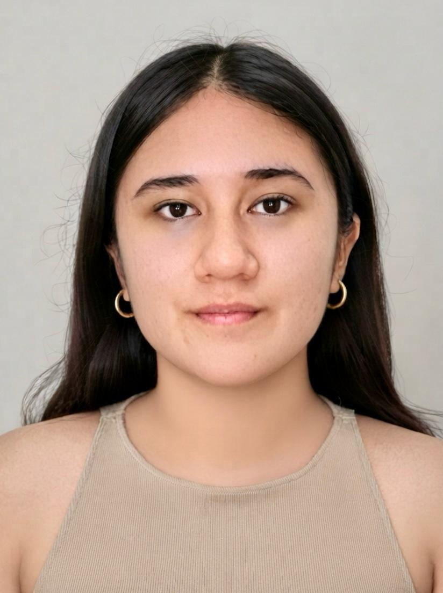

<div align="center">

# INTRODUCCIÓN A SEÑALES BIOMÉDICAS (ISB)
### Proyecto Final de Curso — Semestre 2026-II
**Facultad de Ciencias e Ingeniería \| Departamento Académico de Ingeniería**
*Universidad Peruana Cayetano Heredia (UPCH) — Pontificia Universidad Católica del Perú (PUCP)*


</div>

---

## 1. Visión General del Proyecto


### Descripción Preliminar
Este repositorio albergará el desarrollo del proyecto semestral de la asignatura, enfocado en el diseño, adquisición, acondicionamiento de bioseñales (EMG, ECG o EEG), filtrado digital avanzado (Wavelets / Filtros Adaptativos / ICA), procesamiento e integración de modelos de *Machine Learning / TinyML* y despliegue en un prototipo funcional con interfaz de usuario.


## 2. Integrantes del Equipo — GRUPO 4

| Foto | Integrante | Descripción | Rol / Coordinación Asignada | Correo |
|:---:|:---:|:---:|:---:|:---:|
|   | **José Fernando Vera Meza** | Estudiante de octavo ciclo de la carrera de Ingeniería Biomédica. Interés en el campo de Ingeniería Clínica. | Coordinación Principal | <a href="mailto:jose.vera.m@upch.pe">jose.vera.m@upch.pe</a> |
|  | **Geraldine Mayte Segura Villarreal** | Estudiante de octavo ciclo de la carrera de Ingeniería Biomédica. Interés en el campo de Señales e Imágenes, e Ingeniería Clínica. | Coordinación Técnica — Hardware | <a href="mailto:geraldine.segura@upch.pe">geraldine.segura@upch.pe</a> |
|  | **Astrid Sophia Mejía Barreto** | Estudiante de séptimo ciclo de Ingeniería Biomédica. Interés en el campo de Señales e Imágenes, y Tejidos y Biomateriales. | Coordinación Técnica — Software | <a href="mailto:astrid.mejia@upch.pe">astrid.mejia@upch.pe</a> |
|  | **Solangel Macedo Pereira** | Estudiante de septimo ciclo de Ingenería Biomédica. Interés en el campo de Biomateriales e Ingenería Clínica | Coordinación Administrativa | <a href="mailto:solangel.macedo@upch.pe">solangel.macedo@upch.pe</a> |

---

## 3. Estructura y Navegación del Repositorio

La organización de carpetas y archivos del repositorio es la siguiente:
```text
├── 1. CITI program - certificados/     # Certificados de ética e investigación biomédica (CITI)
│   ├── Certificado_Astrid_Mejia.pdf
│   ├── Certificado_Solangel_Macedo.pdf
│   ├── Certificado_Jose_Vera.pdf
│   └── Certificado_Geraldine_Segura.pdf
│
├── 2. Laboratorios/                    # Informes y entregables de cada práctica de laboratorio
│   ├── Lab_01/                         # Laboratorio 1: Introducción, Git y GitHub
│   │   └── git-Github.md               # Guía y reporte de trabajo en Git/GitHub
│   ├── Lab_02/                         # Laboratorio 2: Adquisición de señales EMG
│   ├── Lab_03/                         # Laboratorio 3: Adquisición y filtrado de señales ECG
│   └── ...                             # Siguientes prácticas (EEG, filtros, ML, TinyML)
│
├── 3. Proyecto/                        # Proyecto Final del curso de Señales Biomédicas
│   ├── Hardware/                       # Esquemáticos, diseño de circuitos y sensores del proyecto
│   │   └── README.md                   # Descripción técnica de hardware y componentes
│   └── Software/                       # Scripts de procesamiento en Python, filtros y algoritmos
│       └── README.md                   # Dependencias, librerías e instrucciones de ejecución
│
└── README.md                           # Documentación principal del repositorio (este archivo)
```


## 4. Licencia e Integridad Académica
Este repositorio se desarrolla con fines académicos para el curso **C1132 - Introducción a Señales Biomédicas**. Toda la información, referencias y códigos respetan las normativas institucionales de integridad académica de la UPCH / PUCP. Distribuido bajo la Licencia [MIT](LICENSE).
